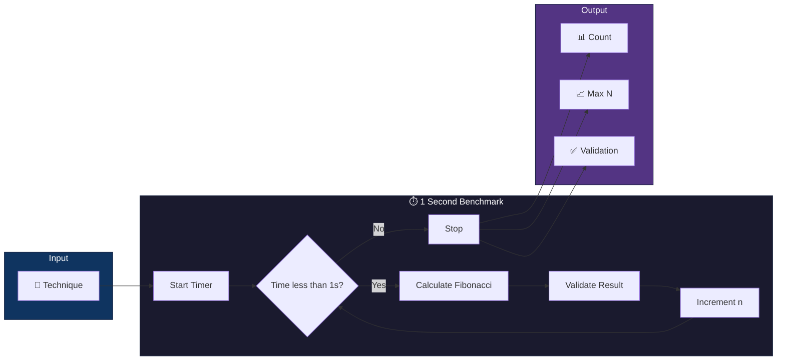
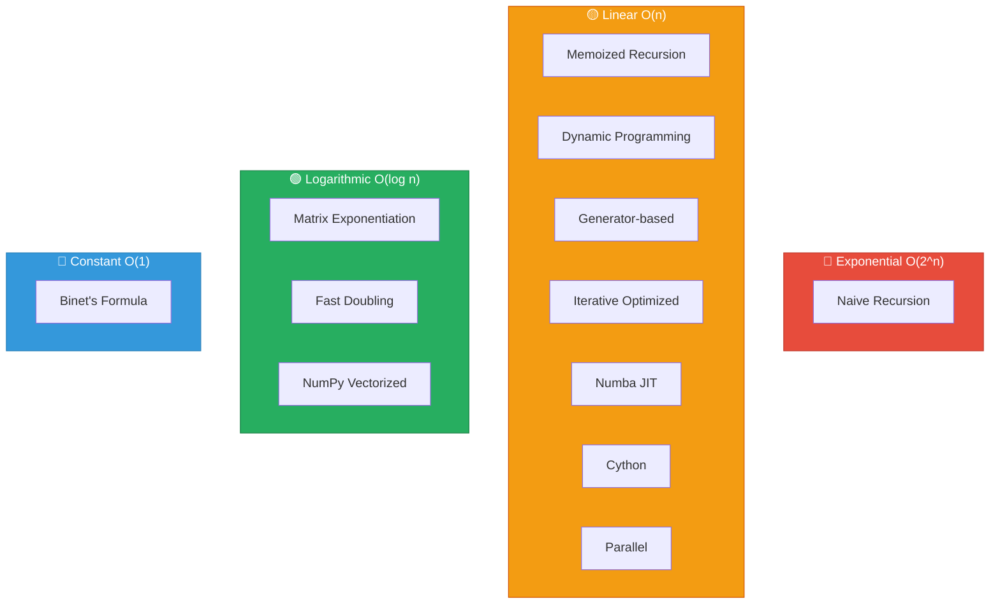

<div align="center">


**An Educational Benchmark Suite for Fibonacci Calculation Techniques in Python**

[](https://python.org)
[](https://numpy.org)
[](LICENSE)
[]()
[](CONTRIBUTING.md)

*Compare 12 different algorithms for computing Fibonacci numbers, measuring how many each can calculate in one second.*

[📖 Documentation](#-documentation) •
[🚀 Quick Start](#-quick-start) •
[📊 Results](#-sample-output) •
[🧮 Techniques](#-implemented-techniques)

</div>

---

## 🎯 What This Project Does



Each technique runs for **exactly 1 second**, computing Fibonacci numbers F(0), F(1), F(2), ... until time runs out.

| Metric | Description |
|--------|-------------|
| 📊 **Count** | Total Fibonacci numbers calculated |
| 📈 **Max N** | Highest index reached (e.g., F(50000)) |
| ✅ **Correctness** | Results validated against known values |

> [!TIP]
> This reveals the dramatic difference between O(2^n), O(n), and O(log n) algorithms!

---

## 🚀 Quick Start

```bash
# Clone or navigate to the project
cd SpeedyFibonacci

# Create virtual environment
python3 -m venv venv
source venv/bin/activate  # On Windows: venv\Scripts\activate

# Install dependencies
pip install -r requirements.txt

# Run the benchmark
python scripts/run_benchmark.py
```

<details>
<summary>📋 <strong>Command Line Options</strong></summary>

```bash
# Run for 5 seconds per technique
python scripts/run_benchmark.py --duration 5

# Skip visualizations (faster)
python scripts/run_benchmark.py --no-plots

# Run specific technique(s)
python scripts/run_benchmark.py --technique "Naive Recursion"

# List all available techniques
python scripts/run_benchmark.py --list

# Minimal output
python scripts/run_benchmark.py --quiet
```

</details>

<details>
<summary>⚡ <strong>Compile Cython (Optional)</strong></summary>

For maximum Cython performance:

```bash
python scripts/setup_cython.py build_ext --inplace
```

</details>

---

## 🧮 Implemented Techniques



| # | Technique | Time | Space | Description |
|:-:|-----------|:----:|:-----:|-------------|
| 1 | 🐢 Naive Recursion | `O(2^n)` | `O(n)` | Classic recursive - slow but educational |
| 2 | 💾 Memoized Recursion | `O(n)` | `O(n)` | Top-down DP with caching |
| 3 | 📊 Dynamic Programming | `O(n)` | `O(n)` | Bottom-up iterative with array |
| 4 | 🔢 Matrix Exponentiation | `O(log n)` | `O(log n)` | `[[1,1],[1,0]]^n` identity |
| 5 | 🌟 Binet's Formula | `O(1)*` | `O(1)` | Closed-form with golden ratio φ |
| 6 | 🔄 Generator-based | `O(n)` | `O(1)` | Python generator pattern |
| 7 | 🧊 NumPy Vectorized | `O(log n)` | `O(1)` | NumPy matrix operations |
| 8 | ⚡ Numba JIT | `O(n)` | `O(1)` | LLVM-compiled Python |
| 9 | 🚀 Cython Optimized | `O(n)` | `O(1)` | C-extension compilation |
| 10 | 💨 Iterative Optimized | `O(n)` | `O(1)` | Two-variable iteration |
| 11 | ⚡ Fast Doubling | `O(log n)` | `O(log n)` | F(2n) identity method |
| 12 | 🔀 Parallel Processing | `O(n)` | `O(n)` | Multiprocessing demo |

> [!NOTE]
> *Binet's formula is O(1) theoretically but precision-limited for large n due to floating-point arithmetic.

---

## 📊 Sample Output

```
╔═══════════════════════════════════════════════════════════════╗
║   SpeedyFibonacci Benchmark Results                           ║
╚═══════════════════════════════════════════════════════════════╝

┌──────┬─────────────────────────────┬───────────────────┬─────────┐
│ Rank │ Technique                   │ Numbers Calculated│ Max N   │
├──────┼─────────────────────────────┼───────────────────┼─────────┤
│ 1    │ Numba JIT                   │ 847,293           │ 847,292 │
│ 2    │ Iterative Space-Optimized   │ 623,481           │ 623,480 │
│ 3    │ Generator-based             │ 589,234           │ 589,233 │
│ ...  │ ...                         │ ...               │ ...     │
│ 12   │ Naive Recursion             │ 35                │ 34      │
└──────┴─────────────────────────────┴───────────────────┴─────────┘

🏆 Fastest: Numba JIT (847,293 numbers)
📈 Highest N: Fast Doubling (reached n=1,234,567)
```

### 📁 Generated Output

| Type | Location | Description |
|------|----------|-------------|
| 📋 Console Table | Terminal | Colored, ranked comparison |
| 📄 CSV Files | `results/benchmark_results_*.csv` | Raw data export |
| 📊 Visualizations | `results/*_comparison.png` | Matplotlib charts |

---

## 🏗️ Project Structure

```
SpeedyFibonacci/
│
├── 📄 README.md                    # You are here!
├── 📄 requirements.txt             # Python dependencies
├── 📄 pyproject.toml               # Project configuration
├── 📄 .gitignore                   # Git ignore patterns
│
├── 📁 techniques/                  # 12 Fibonacci implementations
│   ├── 📁 01_naive_recursion/
│   │   ├── 🐍 fibonacci.py         # Implementation
│   │   └── 📄 README.md            # Algorithm documentation
│   ├── 📁 02_memoized_recursion/
│   ├── 📁 03_dynamic_programming/
│   ├── 📁 04_matrix_exponentiation/
│   ├── 📁 05_binets_formula/
│   ├── 📁 06_generator_based/
│   ├── 📁 07_numpy_vectorized/
│   ├── 📁 08_numba_jit/
│   ├── 📁 09_cython_optimized/
│   ├── 📁 10_iterative_space_optimized/
│   ├── 📁 11_fast_doubling/
│   └── 📁 12_parallel_processing/
│
├── 📁 benchmarking/                # Benchmark infrastructure
│   ├── 🐍 benchmark_runner.py      # Main orchestrator
│   ├── 🐍 technique_loader.py      # Dynamic discovery
│   ├── 🐍 timer.py                 # Precision timing
│   └── 🐍 validators.py            # Result validation
│
├── 📁 output/                      # Result presentation
│   ├── 🐍 console_formatter.py     # Terminal tables
│   ├── 🐍 csv_exporter.py          # CSV export
│   └── 🐍 visualizer.py            # Matplotlib plots
│
├── 📁 scripts/                     # Entry points
│   ├── 🐍 run_benchmark.py         # Main benchmark runner
│   ├── 🐍 setup_cython.py          # Cython compilation
│   └── 🐍 clean.py                 # Cleanup utility
│
├── 📁 results/                     # Generated output
├── 📁 tests/                       # Unit tests
└── 📁 docs/                        # Additional documentation
    ├── 📄 THEORY.md                # Mathematical foundations
    ├── 📄 COMPLEXITY_ANALYSIS.md   # Big-O deep dive
    ├── 📄 CITATIONS.md             # Academic references
    └── 📄 SETUP.md                 # Detailed setup guide
```

---

## 🎓 Educational Value

```mermaid
mindmap
  root((SpeedyFibonacci))
    Algorithm Complexity
      O(2^n) vs O(n) vs O(log n)
      Real-world performance
      Call tree visualization
    Dynamic Programming
      Top-down memoization
      Bottom-up tabulation
      Space-time tradeoffs
    Python Optimization
      NumPy vectorization
      Numba JIT compilation
      Cython C extensions
    Mathematics
      Golden ratio φ
      Matrix identities
      Binet's formula
    Software Design
      Abstract interfaces
      Modular architecture
      Benchmarking methodology
```

---

## 📦 Requirements

| Dependency | Version | Purpose |
|------------|---------|---------|
|  | ≥3.11 | Runtime |
|  | ≥1.24.0 | Matrix operations |
|  | ≥0.57.0 | JIT compilation |
|  | ≥3.0.0 | C extensions |
|  | ≥3.7.0 | Visualization |
|  | ≥2.0.0 | Data handling |
|  | ≥13.0.0 | Console formatting |

---

## 🧪 Testing

```bash
# Install test dependencies
pip install -r requirements-dev.txt

# Run tests
pytest tests/ -v

# Run with coverage
pytest tests/ -v --cov=.
```

---

## 📖 Documentation

| Document | Description |
|----------|-------------|
| 📐 [Theory](docs/THEORY.md) | Mathematical foundations, golden ratio, Binet's formula |
| 📊 [Complexity Analysis](docs/COMPLEXITY_ANALYSIS.md) | Detailed Big-O analysis for each technique |
| 📚 [Citations](docs/CITATIONS.md) | Academic references and bibliography |
| 🔧 [Setup Guide](docs/SETUP.md) | Detailed installation instructions |

---

## 🤝 Contributing


1. Add new technique in `techniques/XX_name/`
2. Inherit from `FibonacciTechnique`
3. Write README with complexity analysis
4. Add tests in `tests/`
5. Submit a pull request!

> [!IMPORTANT]
> All techniques must implement the `FibonacciTechnique` abstract base class interface.

---

## 📚 Academic References

<details>
<summary>📖 <strong>Key Citations</strong></summary>

1. **Cormen, T.H., et al.** (2009). *Introduction to Algorithms* (3rd ed.). MIT Press.
2. **Knuth, D.E.** (1997). *The Art of Computer Programming, Vol. 1*. Addison-Wesley.
3. **Nayuki**. "Fast Fibonacci algorithms". https://www.nayuki.io/page/fast-fibonacci-algorithms

See [docs/CITATIONS.md](docs/CITATIONS.md) for complete bibliography.

</details>

---

## 📜 License

```
MIT License

Copyright (c) 2025 SpeedyFibonacci

Permission is hereby granted, free of charge, to any person obtaining a copy
of this software and associated documentation files.
```

---

<div align="center">

## 🙏 Acknowledgments

*The algorithms implemented here represent decades of mathematical and computer science research.*

Thanks to the Python scientific computing ecosystem:

[](https://numpy.org)
[](https://numba.pydata.org)
[](https://cython.org)

---

**⭐ Star this repo if you find it useful!**

*Inspired by the elegance of the Fibonacci sequence and its deep connections to mathematics* 🌻

</div>
