<div align="center">

# 📚 Academic Citations

[]()
[]()

*Complete bibliography and academic references for SpeedyFibonacci*

</div>

---

## 📖 Table of Contents

- [Primary Algorithm References](#-primary-algorithm-references)
- [Fibonacci Mathematics](#-fibonacci-mathematics)
- [Python Implementation References](#-python-implementation-references)
- [Parallel Computing](#-parallel-computing)
- [Algorithm Analysis](#-algorithm-analysis)
- [Citing This Project](#-citing-this-project)

---

## 📐 Primary Algorithm References

### 🔄 Dynamic Programming and Memoization

| # | Citation | Topic |
|:-:|----------|-------|
| 1 | **Bellman, R.** (1957). *Dynamic Programming*. Princeton University Press. | Foundational DP work |
| 2 | **Michie, D.** (1968). "Memo Functions and Machine Learning". *Nature*, 218, 19-22. | Original memoization |
| 3 | **Cormen, T.H., Leiserson, C.E., Rivest, R.L., & Stein, C.** (2009). *Introduction to Algorithms* (3rd ed.). MIT Press. Chapter 15. | Standard reference |

### 🔢 Matrix Exponentiation

| # | Citation | Topic |
|:-:|----------|-------|
| 4 | **Gries, D., & Levin, G.** (1980). "Computing Fibonacci Numbers (and Similarly Defined Functions) in Log Time". *Information Processing Letters*, 11(2), 68-69. | O(log n) method |
| 5 | **Knuth, D.E.** (1997). *The Art of Computer Programming, Volume 1: Fundamental Algorithms* (3rd ed.). Addison-Wesley. Section 1.2.8. | Comprehensive |

### 🌟 Binet's Formula

| # | Citation | Topic |
|:-:|----------|-------|
| 6 | **Binet, J.P.M.** (1843). "Mémoire sur l'intégration des équations linéaires aux différences finies". *Comptes Rendus de l'Académie des Sciences*, Paris. | Original publication |
| 7 | **de Moivre, A.** (1718). *The Doctrine of Chances*. | Earlier derivation |

### ⚡ Fast Doubling

| # | Citation | Topic |
|:-:|----------|-------|
| 8 | **Takahashi, D.** (2000). "A Fast Algorithm for Computing Large Fibonacci Numbers". *Information Processing Letters*, 75(6), 243-246. | Fast algorithm |
| 9 | **Nayuki**. "Fast Fibonacci algorithms". [nayuki.io](https://www.nayuki.io/page/fast-fibonacci-algorithms) | Modern exposition |

---

## 🔢 Fibonacci Mathematics

### 📘 General References

```mermaid
mindmap
  root((📚 Key Books))
    Koshy 2001
      Fibonacci & Lucas Numbers
      Applications
    Vorobiev 2002
      Fibonacci Numbers
      Birkhäuser
    Dunlap 1997
      Golden Ratio
      World Scientific
    Knuth 1997
      TAOCP Vol 1
      Section 1.2.8
```



| # | Citation | Focus |
|:-:|----------|-------|
| 10 | **Koshy, T.** (2001). *Fibonacci and Lucas Numbers with Applications*. Wiley-Interscience. | Comprehensive |
| 11 | **Vorobiev, N.N.** (2002). *Fibonacci Numbers*. Birkhäuser. | Accessible intro |
| 12 | **Dunlap, R.A.** (1997). *The Golden Ratio and Fibonacci Numbers*. World Scientific. | Golden ratio |

### 📜 Historical Context

| # | Citation | Topic |
|:-:|----------|-------|
| 13 | **Sigler, L.E.** (2002). *Fibonacci's Liber Abaci: A Translation into Modern English of Leonardo Pisano's Book of Calculation*. Springer. | Original text |
| 14 | **Horadam, A.F.** (1961). "A Generalized Fibonacci Sequence". *The American Mathematical Monthly*, 68(5), 455-459. | Generalizations |

---

## 🐍 Python Implementation References

### 📄 Python Documentation

| # | Resource | Topic |
|:-:|----------|-------|
| 15 | Python Software Foundation. `functools.lru_cache`. [docs.python.org](https://docs.python.org/3/library/functools.html#functools.lru_cache) | Memoization |
| 16 | Python Software Foundation. "Generators". [docs.python.org](https://docs.python.org/3/tutorial/classes.html#generators) | Generator pattern |

### 🧮 NumPy

| # | Citation | Topic |
|:-:|----------|-------|
| 17 | **Harris, C.R., Millman, K.J., van der Walt, S.J., et al.** (2020). "Array programming with NumPy". *Nature*, 585, 357-362. | NumPy paper |
| 18 | **Van Der Walt, S., Colbert, S.C., & Varoquaux, G.** (2011). "The NumPy Array: A Structure for Efficient Numerical Computation". *Computing in Science & Engineering*, 13(2), 22-30. | Array structure |

### ⚡ Numba

| # | Citation | Topic |
|:-:|----------|-------|
| 19 | **Lam, S.K., Pitrou, A., & Seibert, S.** (2015). "Numba: A LLVM-based Python JIT Compiler". *Proceedings of the Second Workshop on the LLVM Compiler Infrastructure in HPC*. | JIT compilation |

### 🚀 Cython

| # | Citation | Topic |
|:-:|----------|-------|
| 20 | **Behnel, S., Bradshaw, R., Citro, C., Dalcin, L., Seljebotn, D.S., & Smith, K.** (2011). "Cython: The Best of Both Worlds". *Computing in Science & Engineering*, 13(2), 31-39. | Cython paper |
| 21 | **Smith, K.** (2015). *Cython: A Guide for Python Programmers*. O'Reilly Media. | Cython guide |

---

## 🔀 Parallel Computing

| # | Citation | Topic |
|:-:|----------|-------|
| 22 | **Amdahl, G.M.** (1967). "Validity of the single processor approach to achieving large scale computing capabilities". *AFIPS Conference Proceedings*, 30, 483-485. | Amdahl's Law |
| 23 | Python Software Foundation. `multiprocessing`. [docs.python.org](https://docs.python.org/3/library/multiprocessing.html) | Multiprocessing |

---

## 📊 Algorithm Analysis

| # | Citation | Topic |
|:-:|----------|-------|
| 24 | **Sedgewick, R., & Wayne, K.** (2011). *Algorithms* (4th ed.). Addison-Wesley. Chapter 1. | Analysis |
| 25 | **Kleinberg, J., & Tardos, E.** (2005). *Algorithm Design*. Addison-Wesley. Chapter 6. | DP |
| 26 | **Graham, R.L., Knuth, D.E., & Patashnik, O.** (1994). *Concrete Mathematics: A Foundation for Computer Science* (2nd ed.). Addison-Wesley. Chapter 6. | Special numbers |

---

## 🌐 Online Resources

| # | Resource | Description |
|:-:|----------|-------------|
| 27 | **OEIS Foundation**. [A000045: Fibonacci numbers](https://oeis.org/A000045) | Integer sequence |
| 28 | **Wikipedia**. [Fibonacci number](https://en.wikipedia.org/wiki/Fibonacci_number) | General reference |
| 29 | **Project Euler**. [projecteuler.net](https://projecteuler.net/) | Related problems |

---

## 📖 Books on Python Performance

| # | Citation | Topic |
|:-:|----------|-------|
| 30 | **Gorelick, M., & Ozsvald, I.** (2020). *High Performance Python* (2nd ed.). O'Reilly Media. | Performance |
| 31 | **Lanaro, G.** (2017). *Python High Performance* (2nd ed.). Packt Publishing. | Optimization |
| 32 | **Ramalho, L.** (2015). *Fluent Python*. O'Reilly Media. Chapter 14. | Generators |

---

## 📝 Citing This Project

<details>
<summary>📋 <strong>BibTeX Format</strong></summary>

```bibtex
@misc{speedyfibonacci2024,
  author       = {SpeedyFibonacci Contributors},
  title        = {SpeedyFibonacci: An Educational Benchmark Suite for
                  Fibonacci Calculation Techniques in Python},
  year         = {2024},
  publisher    = {GitHub},
  howpublished = {\url{https://github.com/[username]/SpeedyFibonacci}}
}
```

</details>

<details>
<summary>📋 <strong>APA Format</strong></summary>

```text
SpeedyFibonacci Contributors. (2024). SpeedyFibonacci: An Educational
Benchmark Suite for Fibonacci Calculation Techniques in Python.
GitHub repository. https://github.com/[username]/SpeedyFibonacci
```

</details>

<details>
<summary>📋 <strong>MLA Format</strong></summary>

```text
SpeedyFibonacci Contributors. "SpeedyFibonacci: An Educational Benchmark
Suite for Fibonacci Calculation Techniques in Python." GitHub, 2024,
https://github.com/[username]/SpeedyFibonacci.
```

</details>

---

## 🙏 Acknowledgments

> This project builds upon decades of mathematical and computer science research. We gratefully acknowledge the contributions of the researchers and developers whose work made this project possible.

---

<div align="center">

[← Back to Main README](../README.md)

</div>
