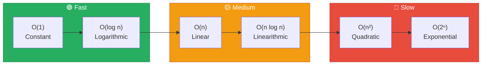
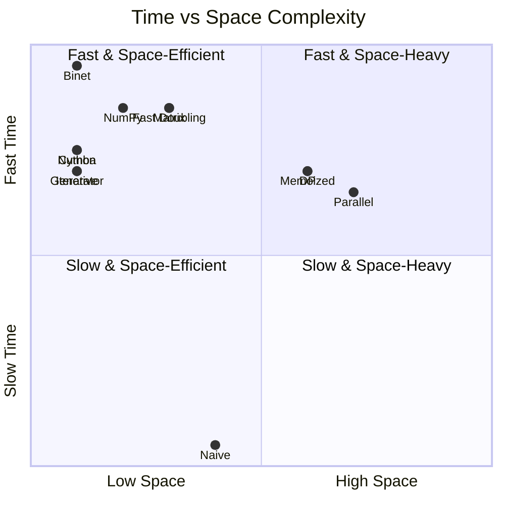
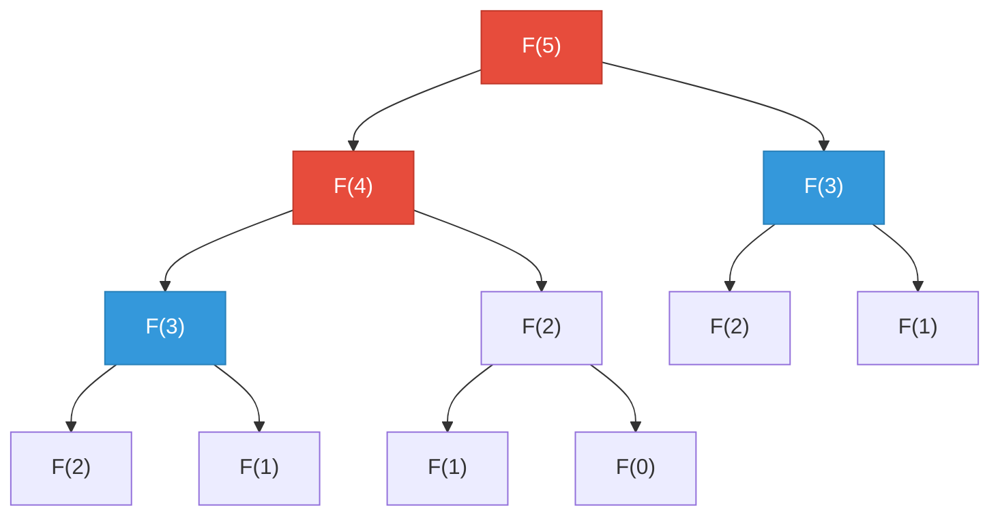
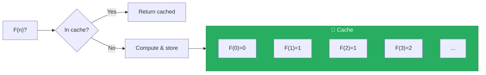
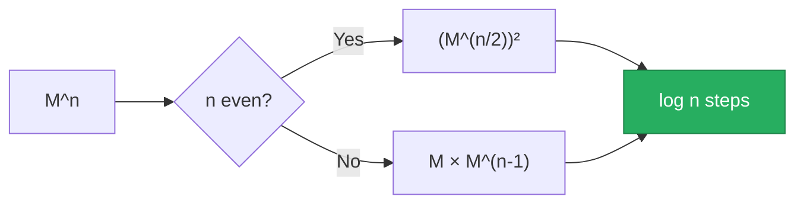
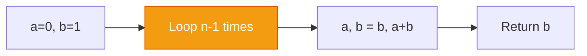
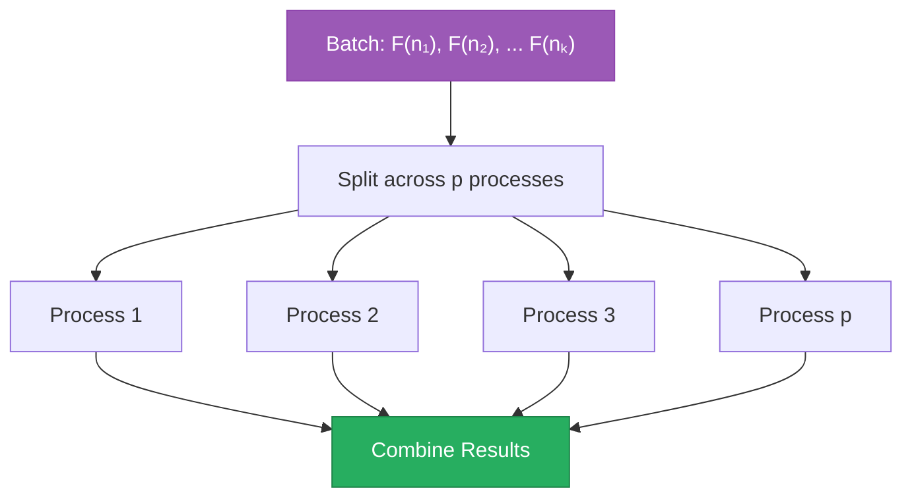
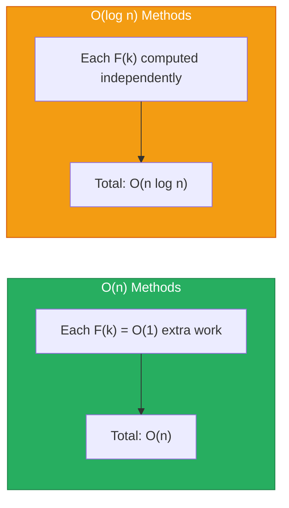
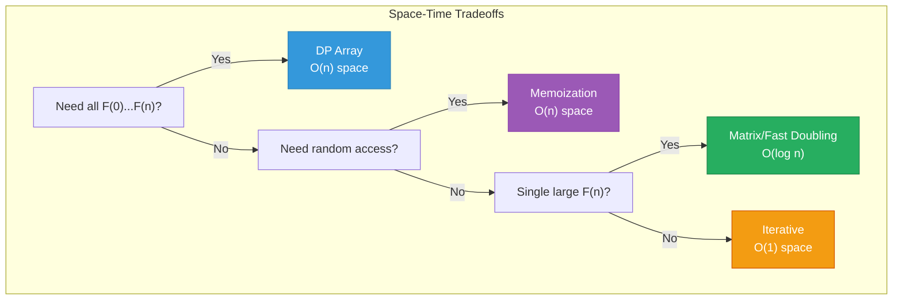

<div align="center">

# 📊 Complexity Analysis

[]()
[]()

*Deep dive into the time and space complexity of each Fibonacci technique*

</div>

---

## 📖 Table of Contents

- [Big-O Notation Primer](#-big-o-notation-primer)
- [Complexity Summary](#-complexity-summary)
- [Detailed Analysis](#-detailed-analysis)
- [Practical Performance](#-practical-performance)
- [Space-Time Tradeoffs](#%EF%B8%8F-space-time-tradeoffs)

---

## 🎓 Big-O Notation Primer

Big-O notation describes the **upper bound** of an algorithm's growth rate:



| Notation | Name | Example | Growth |
|:--------:|------|---------|--------|
| `O(1)` | Constant | Array access | Same time regardless of input |
| `O(log n)` | Logarithmic | Binary search | Time grows slowly as input doubles |
| `O(n)` | Linear | Simple loop | Time grows proportionally |
| `O(n log n)` | Linearithmic | Merge sort | Efficient sorting |
| `O(n²)` | Quadratic | Nested loops | Time grows with square of input |
| `O(2ⁿ)` | Exponential | Naive recursion | Time doubles with each addition |

---

## 📋 Complexity Summary



| # | Technique | Time | Space | Operations for F(50) |
|:-:|-----------|:----:|:-----:|:--------------------:|
| 1 | 🐢 Naive Recursion | `O(2ⁿ)` | `O(n)` | ~20 billion |
| 2 | 💾 Memoized Recursion | `O(n)` | `O(n)` | ~50 |
| 3 | 📊 Dynamic Programming | `O(n)` | `O(n)` | ~50 |
| 4 | 🔢 Matrix Exponentiation | `O(log n)` | `O(log n)` | ~18 |
| 5 | 🌟 Binet's Formula | `O(1)*` | `O(1)` | ~5 |
| 6 | 🔄 Generator-based | `O(n)` | `O(1)` | ~50 |
| 7 | 🧊 NumPy Vectorized | `O(log n)` | `O(1)` | ~18 |
| 8 | ⚡ Numba JIT | `O(n)` | `O(1)` | ~50 |
| 9 | 🚀 Cython Optimized | `O(n)` | `O(1)` | ~50 |
| 10 | 💨 Iterative Optimized | `O(n)` | `O(1)` | ~50 |
| 11 | ⚡ Fast Doubling | `O(log n)` | `O(log n)` | ~18 |
| 12 | 🔀 Parallel Processing | `O(n)` | `O(n)` | ~50 |

> [!NOTE]
> *Binet's O(1) assumes bounded precision; true arbitrary precision requires O(n) for the result itself.

---

## 🔍 Detailed Analysis

### 1️⃣ Naive Recursion — O(2ⁿ)



**The recurrence tree has exponential nodes:**

| n | Function Calls | Approximate |
|---|----------------|-------------|
| 10 | 177 | ~10² |
| 20 | 21,891 | ~10⁴ |
| 30 | 2,692,537 | ~10⁶ |
| 40 | 331,160,281 | ~10⁸ |
| 50 | **~20 billion** | ~10¹⁰ |

> [!WARNING]
> Each call branches into 2 more calls, causing exponential growth!

---

### 2️⃣ Memoized Recursion — O(n)



**With memoization, each F(k) is computed exactly once:**
- n+1 unique subproblems
- O(1) work per subproblem
- **Total: O(n)**

---

### 3️⃣ Dynamic Programming — O(n)

```python
# Single loop from 2 to n
for i in range(2, n+1):
    dp[i] = dp[i-1] + dp[i-2]  # O(1) per iteration
```

| Metric | Value |
|--------|-------|
| Time | n-1 iterations × O(1) = **O(n)** |
| Space | Array of size n+1 = **O(n)** |

---

### 4️⃣ Matrix Exponentiation — O(log n)



**Binary exponentiation reduces multiplications:**

| n | Matrix Multiplications |
|---|------------------------|
| 100 | 7 |
| 1,000 | 10 |
| 1,000,000 | 20 |

---

### 5️⃣ Binet's Formula — O(1)*

```
F(n) = (φⁿ - ψⁿ) / √5
```

**Constant number of operations:** exponentiation, subtraction, division.

> [!CAUTION]
> **Caveat:** Floating-point precision limits accuracy. With arbitrary precision, computing φⁿ for n-bit precision takes O(n) time.

---

### 6️⃣-10️⃣ Iterative Methods — O(n)

All iterative methods share the same complexity:



| Method | Time | Space | Notes |
|--------|------|-------|-------|
| Generator | O(n) | O(1) | Lazy evaluation |
| Iterative | O(n) | O(1) | Two variables |
| Numba JIT | O(n) | O(1) | LLVM compiled |
| Cython | O(n) | O(1) | C extension |

---

### 1️⃣1️⃣ Fast Doubling — O(log n)

Uses identities to "jump" through the sequence:

```
F(2n)   = F(n) × [2×F(n+1) - F(n)]
F(2n+1) = F(n)² + F(n+1)²
```

| Metric | Value |
|--------|-------|
| Recursion depth | log₂(n) |
| Operations per level | O(1) |
| **Total** | **O(log n)** |

---

### 1️⃣2️⃣ Parallel Processing — O(n)



| Scenario | Time Complexity |
|----------|-----------------|
| Single F(n) | O(n) — no benefit |
| Batch of k values, p cores | O(max(nᵢ) × k/p) |

---

## 📈 Practical Performance

> [!IMPORTANT]
> Algorithm complexity doesn't tell the whole story. Real performance depends on constant factors, integer size, and interpreter overhead.

### Expected Benchmark Results

| Complexity Class | Typical Count (1s) | Example Techniques |
|------------------|-------------------:|-------------------|
| 🔴 O(2ⁿ) | 30-35 | Naive Recursion |
| 🟡 O(n) interpreted | 10,000-50,000 | DP, Generator |
| 🟢 O(n) compiled | 100,000-1,000,000 | Numba, Cython |
| 🔵 O(log n) | Varies | Matrix, Fast Doubling |
| ⭐ O(1) | Millions | Binet (fixed precision) |

### Why O(log n) Isn't Always Fastest

For our **sequential benchmark** (F(0), F(1), F(2), ...):



> [!TIP]
> O(log n) excels when computing **single large** F(n) values, not sequential computation!

---

## ⚖️ Space-Time Tradeoffs



| Use Case | Best Method | Time | Space |
|----------|-------------|------|-------|
| All F(0)...F(n) | DP Array | O(n) | O(n) |
| Single F(n), memory limited | Iterative | O(n) | O(1) |
| Random access to F(k) | Memoized | O(n) | O(n) |
| Single large F(n) | Matrix/Fast Doubling | O(log n) | O(log n) |

---

## 🔢 Integer Arithmetic Complexity

> [!NOTE]
> For very large Fibonacci numbers, arithmetic on big integers becomes significant.

| Operation | Naive | Karatsuba | FFT |
|-----------|:-----:|:---------:|:---:|
| Multiplication | O(d²) | O(d^1.58) | O(d log d) |
| Addition | O(d) | O(d) | O(d) |

Where **d = number of digits ≈ 0.21n** for F(n).

**Example:** For n = 1,000,000, F(n) has ~210,000 digits. Big integer multiplication becomes the bottleneck!

---

## 📚 References

1. **Cormen, T.H., et al.** (2009). *Introduction to Algorithms*. Chapter 3: Growth of Functions.
2. **Sedgewick, R., & Wayne, K.** (2011). *Algorithms*. Chapter 1.4: Analysis of Algorithms.
3. **Knuth, D.E.** (1997). *The Art of Computer Programming, Vol. 2*. Chapter 4.3.3: Big Numbers.

---

<div align="center">

[← Back to Main README](../README.md)

</div>
