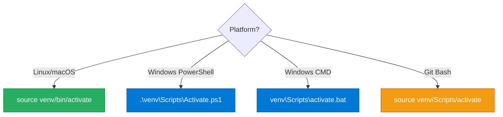

<div align="center">

# 🔧 Setup Guide

[](https://python.org)
[]()
[]()
[]()

*Detailed installation instructions for SpeedyFibonacci*

</div>

---

## 📖 Table of Contents

- [Requirements](#-requirements)
- [Quick Setup](#-quick-setup)
- [Platform-Specific Setup](#-platform-specific-setup)
- [Virtual Environment Management](#-virtual-environment-management)
- [Dependency Details](#-dependency-details)
- [Cython Compilation](#-cython-compilation)
- [Verification](#-verification)
- [Troubleshooting](#-troubleshooting)

---

## 📋 Requirements

| Requirement | Version | Notes |
|-------------|---------|-------|
|  | ≥3.11 | Required |
| Operating System | Linux, macOS, Windows | All supported |
| C Compiler | gcc, clang, or MSVC | Optional (for Cython) |

---

## 🚀 Quick Setup

```bash
# 1️⃣ Navigate to project directory
cd SpeedyFibonacci

# 2️⃣ Create virtual environment
python3 -m venv venv

# 3️⃣ Activate virtual environment
source venv/bin/activate  # Linux/macOS
# OR
venv\Scripts\activate     # Windows

# 4️⃣ Install dependencies
pip install -r requirements.txt

# 5️⃣ Run benchmark
python scripts/run_benchmark.py
```

> [!TIP]
> That's it! For most users, these 5 steps are all you need.

---

## 💻 Platform-Specific Setup

### 🐧 Linux (Ubuntu/Debian)

<details>
<summary>📋 <strong>Click to expand</strong></summary>

```bash
# Install Python 3.11+ if needed
sudo apt update
sudo apt install python3.11 python3.11-venv python3.11-dev

# Install C compiler for Cython (optional)
sudo apt install build-essential

# Create and activate virtual environment
python3.11 -m venv venv
source venv/bin/activate

# Install dependencies
pip install --upgrade pip
pip install -r requirements.txt

# Compile Cython (optional, for maximum performance)
pip install Cython
python scripts/setup_cython.py build_ext --inplace
```

</details>

### 🍎 macOS

<details>
<summary>📋 <strong>Click to expand</strong></summary>

```bash
# Install Python via Homebrew (if needed)
brew install python@3.11

# Xcode command line tools (for Cython)
xcode-select --install

# Create virtual environment
python3.11 -m venv venv
source venv/bin/activate

# Install dependencies
pip install --upgrade pip
pip install -r requirements.txt

# Compile Cython (optional)
python scripts/setup_cython.py build_ext --inplace
```

</details>

### 🪟 Windows

<details>
<summary>📋 <strong>Click to expand</strong></summary>

```powershell
# Using Python from python.org
# Download and install Python 3.11+ from https://www.python.org/downloads/

# Create virtual environment
python -m venv venv

# Activate (PowerShell)
.\venv\Scripts\Activate.ps1
# OR (Command Prompt)
venv\Scripts\activate.bat

# Install dependencies
pip install --upgrade pip
pip install -r requirements.txt

# For Cython: Install Visual Studio Build Tools
# Download from: https://visualstudio.microsoft.com/visual-cpp-build-tools/
# Select "C++ build tools" workload

# Compile Cython (optional)
python scripts/setup_cython.py build_ext --inplace
```

</details>

---

## 🔄 Virtual Environment Management

### Activation Commands



| Platform | Command |
|----------|---------|
| 🐧 Linux/macOS | `source venv/bin/activate` |
| 🪟 Windows (PowerShell) | `.\venv\Scripts\Activate.ps1` |
| 🪟 Windows (cmd) | `venv\Scripts\activate.bat` |
| 🐧 Windows (Git Bash) | `source venv/Scripts/activate` |

### Deactivation

```bash
deactivate
```

### Removing Environment

```bash
# Deactivate first
deactivate

# Remove venv directory
rm -rf venv        # Linux/macOS
rmdir /s /q venv   # Windows
```

---

## 📦 Dependency Details

### Core Dependencies

| Package | Version | Purpose | Required |
|---------|---------|---------|:--------:|
|  | ≥1.24.0 | NumPy vectorized technique | ✅ |
|  | ≥0.57.0 | JIT compilation | ✅ |
|  | ≥3.0.0 | C extension compilation | ✅ |
|  | ≥3.7.0 | Visualization plots | ✅ |
|  | ≥0.9.0 | Console table formatting | ✅ |
|  | ≥2.0.0 | Data handling | ✅ |
|  | ≥13.0.0 | Colored console output | ✅ |

### Development Dependencies

```bash
pip install -r requirements-dev.txt
```

| Package | Purpose |
|---------|---------|
| pytest | Unit testing |
| pytest-cov | Coverage reporting |
| black | Code formatting |
| mypy | Type checking |
| flake8 | Linting |

---

## 🔨 Cython Compilation

### Why Compile Cython?


| Feature | Pure Python | Compiled Cython |
|---------|:-----------:|:---------------:|
| Speed | 1x | 10-100x |
| C-level operations | ❌ | ✅ |
| Static typing | ❌ | ✅ |

### Compilation Steps

```bash
# Ensure Cython is installed
pip install Cython

# Run the setup script
python scripts/setup_cython.py build_ext --inplace

# Verify compilation
python -c "from techniques.09_cython_optimized.fibonacci_impl import fib_cython; print(fib_cython(10))"
# Should print: 55
```

### Compilation Output

Successfully compiled, you'll see:

| Platform | Output File |
|----------|------------|
| 🐧 Linux | `fibonacci_impl.cpython-311-x86_64-linux-gnu.so` |
| 🍎 macOS | `fibonacci_impl.cpython-311-darwin.so` |
| 🪟 Windows | `fibonacci_impl.cpython-311-win_amd64.pyd` |

<details>
<summary>⚠️ <strong>Troubleshooting Compilation</strong></summary>

**Error: "Unable to find vcvarsall.bat" (Windows)**
- Install Visual Studio Build Tools
- Or use mingw: `pip install mingw-w64`

**Error: "gcc not found" (Linux)**
```bash
sudo apt install build-essential
```

**Error: "clang not found" (macOS)**
```bash
xcode-select --install
```

</details>

---

## ✅ Verification

After setup, verify everything works:

```bash
# Run tests
pytest tests/ -v

# Run quick benchmark
python scripts/run_benchmark.py --duration 0.5

# List techniques
python scripts/run_benchmark.py --list
```

### Expected Output

```text
Available Fibonacci techniques:
----------------------------------------
 1. Naive Recursion
    Classic recursive implementation without optimization
    Time: O(2^n), Space: O(n)

 2. Memoized Recursion
    ...
```

---

## 🔧 Troubleshooting

### Common Issues

<details>
<summary>❌ <strong>"Module not found" errors</strong></summary>

```bash
# Ensure you're in the project root
cd /path/to/SpeedyFibonacci

# Ensure virtual environment is active
source venv/bin/activate

# Reinstall dependencies
pip install -r requirements.txt
```

</details>

<details>
<summary>❌ <strong>Matplotlib display issues (headless server)</strong></summary>

```bash
# Use non-interactive backend
export MPLBACKEND=Agg
python scripts/run_benchmark.py
```

</details>

<details>
<summary>❌ <strong>Permission denied (scripts)</strong></summary>

```bash
chmod +x scripts/*.py
```

</details>

<details>
<summary>❌ <strong>Python version mismatch</strong></summary>

```bash
# Check version
python --version

# Should be 3.11 or higher
# If not, specify full path:
/usr/bin/python3.11 -m venv venv
```

</details>

<details>
<summary>❌ <strong>Numba warnings or errors</strong></summary>

```bash
# Reinstall numba
pip uninstall numba llvmlite
pip install numba

# Verify installation
python -c "import numba; print(numba.__version__)"
```

</details>

---

## 🖥️ IDE Setup

### VS Code

1. Install Python extension
2. Select interpreter: `venv/bin/python`
3. Install recommended extensions when prompted

### PyCharm

1. Open project folder
2. Configure interpreter: `venv/bin/python`
3. Mark `techniques/`, `benchmarking/`, etc. as source roots

---

## 🔄 Updating Dependencies

```bash
# Update all packages
pip install --upgrade -r requirements.txt

# Update specific package
pip install --upgrade numpy

# Check for outdated packages
pip list --outdated
```

---

## 🧹 Cleanup

```bash
# Remove generated files
python scripts/clean.py --all

# Remove virtual environment
deactivate
rm -rf venv
```

---

<div align="center">

> [!NOTE]
> If you encounter any issues not covered here, please [open an issue](https://github.com/[username]/SpeedyFibonacci/issues) on GitHub.

[← Back to Main README](../README.md)

</div>
