<div align="center">

# 📐 Fibonacci Theory and Mathematics

[]()
[]()
[](https://oeis.org/A000045)

</div>

---

## 📖 Table of Contents

- [The Fibonacci Sequence](#-the-fibonacci-sequence)
- [Historical Background](#-historical-background)
- [The Golden Ratio](#-the-golden-ratio-φ)
- [Binet's Formula](#-binets-formula)
- [Matrix Representation](#-matrix-representation)
- [Fast Doubling Identities](#-fast-doubling-identities)
- [Generating Functions](#-generating-functions)
- [Growth Rate](#-growth-rate)
- [Fibonacci in Nature](#-fibonacci-in-nature)

---

## 🔢 The Fibonacci Sequence

The Fibonacci sequence is defined by the recurrence relation:


**The first terms are:**

| n | 0 | 1 | 2 | 3 | 4 | 5 | 6 | 7 | 8 | 9 | 10 | 11 | 12 | 13 |
|---|---|---|---|---|---|---|---|---|---|---|----|----|----|----|
| F(n) | 0 | 1 | 1 | 2 | 3 | 5 | 8 | 13 | 21 | 34 | 55 | 89 | 144 | 233 |

---

## 📜 Historical Background


> [!NOTE]
> The sequence is named after **Leonardo of Pisa** (c. 1170–1250), known as Fibonacci, who introduced it to Western mathematics in his 1202 book *Liber Abaci*. He used it to model rabbit population growth.

<details>
<summary>🐰 <strong>The Original Rabbit Problem</strong></summary>

*"A certain man put a pair of rabbits in a place surrounded on all sides by a wall. How many pairs of rabbits can be produced from that pair in a year if it is supposed that every month each pair begets a new pair which from the second month on becomes productive?"*

— Leonardo of Pisa, Liber Abaci (1202)

</details>

---

## ✨ The Golden Ratio (φ)

The golden ratio is defined as:

$$\phi = \frac{1 + \sqrt{5}}{2} \approx 1.6180339887...$$

Its conjugate is:

$$\psi = \frac{1 - \sqrt{5}}{2} \approx -0.6180339887...$$

### 🔑 Key Properties

| Property | Formula | Value |
|----------|---------|-------|
| Self-squaring | φ² = φ + 1 | 2.618... |
| Reciprocal | 1/φ = φ - 1 | 0.618... |
| Sum | φ + ψ = 1 | 1 |
| Product | φ × ψ = -1 | -1 |
| Continued fraction | φ = 1 + 1/(1 + 1/(1 + ...)) | 1.618... |

### 📊 Fibonacci-Golden Ratio Connection

```mermaid
graph LR
    A["F(n+1)/F(n)"] -->|"n → ∞"| B["φ ≈ 1.618"]

    style A fill:#f39c12,stroke:#d35400,color:#fff
    style B fill:#27ae60,stroke:#1e8449,color:#fff
```



**The ratio of consecutive Fibonacci numbers approaches φ:**

| n | F(n) | F(n+1) | F(n+1)/F(n) |
|---|------|--------|-------------|
| 1 | 1 | 1 | 1.000 |
| 2 | 1 | 2 | 2.000 |
| 3 | 2 | 3 | 1.500 |
| 5 | 5 | 8 | 1.600 |
| 10 | 55 | 89 | 1.6181... |
| 20 | 6765 | 10946 | 1.6180339... |

---

## 🌟 Binet's Formula

Named after Jacques Philippe Marie Binet (published 1843):

$$F(n) = \frac{\phi^n - \psi^n}{\sqrt{5}}$$

```mermaid
flowchart TD
    subgraph Formula["🌟 Binet's Formula"]
        A["F(n) = (φⁿ - ψⁿ) / √5"]
    end

    subgraph Constants["📐 Constants"]
        B["φ = (1 + √5) / 2"]
        C["ψ = (1 - √5) / 2"]
        D["√5 ≈ 2.236"]
    end

    B --> A
    C --> A
    D --> A

    style Formula fill:#9b59b6,stroke:#8e44ad,color:#fff
    style Constants fill:#3498db,stroke:#2980b9,color:#fff
```



<details>
<summary>📝 <strong>Proof Sketch</strong></summary>

**Step 1**: Find characteristic equation
```
x² = x + 1
x² - x - 1 = 0
```

**Step 2**: Solve for roots
```
x = (1 ± √5) / 2
φ = (1 + √5) / 2
ψ = (1 - √5) / 2
```

**Step 3**: General solution form
```
F(n) = Aφⁿ + Bψⁿ
```

**Step 4**: Apply initial conditions
```
F(0) = A + B = 0          → B = -A
F(1) = Aφ + Bψ = 1        → A(φ - ψ) = 1
                           → A = 1/√5
                           → B = -1/√5
```

**Step 5**: Final formula
```
F(n) = (φⁿ - ψⁿ) / √5
```

</details>

### 💡 Simplified Approximation

Since |ψ| < 1, the term ψⁿ becomes negligible for large n:

$$F(n) \approx \frac{\phi^n}{\sqrt{5}} \quad \text{(rounded to nearest integer)}$$

---

## 🔢 Matrix Representation

The Fibonacci recurrence can be expressed as matrix multiplication:

```mermaid
flowchart LR
    A["[F(n+1)]<br/>[F(n)]"] --> B["="]
    B --> C["[1  1]<br/>[1  0]"]
    C --> D["×"]
    D --> E["[F(n)]<br/>[F(n-1)]"]

    style A fill:#e74c3c,stroke:#c0392b,color:#fff
    style C fill:#3498db,stroke:#2980b9,color:#fff
    style E fill:#27ae60,stroke:#1e8449,color:#fff
```



**Therefore:**

$$\begin{bmatrix} F(n+1) & F(n) \\ F(n) & F(n-1) \end{bmatrix} = \begin{bmatrix} 1 & 1 \\ 1 & 0 \end{bmatrix}^n$$

> [!TIP]
> This enables **O(log n)** computation via matrix exponentiation using binary exponentiation!

<details>
<summary>📝 <strong>Proof by Induction</strong></summary>

**Base case (n=1)**:
```
| 1  1 |¹  | 1  1 |   | F(2)  F(1) |
|      | = |      | = |            |
| 1  0 |   | 1  0 |   | F(1)  F(0) |
```
✅ Check: F(2)=1, F(1)=1, F(0)=0

**Inductive step**: If true for n, show for n+1:
```
| 1  1 |ⁿ⁺¹   | 1  1 |ⁿ | 1  1 |
|      |    = |      |  |      |
| 1  0 |      | 1  0 |  | 1  0 |

            | F(n+2)  F(n+1) |
          = |                |  ✓
            | F(n+1)  F(n)   |
```

</details>

---

## ⚡ Fast Doubling Identities

These identities allow computing F(2n) from F(n):

| Identity | Formula |
|----------|---------|
| **F(2n)** | F(n) × [2×F(n+1) - F(n)] |
| **F(2n+1)** | F(n)² + F(n+1)² |

```mermaid
flowchart TD
    A["F(n), F(n+1)"] --> B["F(2n) = F(n) × [2F(n+1) - F(n)]"]
    A --> C["F(2n+1) = F(n)² + F(n+1)²"]

    style A fill:#f39c12,stroke:#d35400,color:#fff
    style B fill:#27ae60,stroke:#1e8449,color:#fff
    style C fill:#3498db,stroke:#2980b9,color:#fff
```



### 🔗 Additional Identities

| Identity | Formula |
|----------|---------|
| F(2n-1) | F(n)² + F(n-1)² |
| F(n+m) | F(n)×F(m-1) + F(n+1)×F(m) |
| gcd(F(m), F(n)) | F(gcd(m, n)) |

---

## 📊 Generating Functions

The ordinary generating function for Fibonacci numbers:

$$G(x) = \sum_{n=0}^{\infty} F(n) \cdot x^n = \frac{x}{1 - x - x^2}$$

<details>
<summary>📝 <strong>Derivation</strong></summary>

```
G(x) = F(0) + F(1)x + F(2)x² + F(3)x³ + ...
     = 0 + x + x² + 2x³ + 3x⁴ + 5x⁵ + ...

xG(x) = x² + x³ + 2x⁴ + 3x⁵ + ...
x²G(x) = x³ + x⁴ + 2x⁵ + ...

G(x) - xG(x) - x²G(x) = x
G(x)(1 - x - x²) = x
G(x) = x / (1 - x - x²)
```

</details>

---

## 📈 Growth Rate

Fibonacci numbers grow exponentially:

$$F(n) \sim \frac{\phi^n}{\sqrt{5}}$$

$$\log_{10}(F(n)) \approx n \times \log_{10}(\phi) \approx 0.209n$$

> [!NOTE]
> So F(n) has approximately **0.209n decimal digits**.

| n | F(n) | Digits |
|---|------|--------|
| 10 | 55 | 2 |
| 100 | 354224848179261915075 | 21 |
| 1,000 | *(209 digits)* | 209 |
| 10,000 | *(2,090 digits)* | 2,090 |

---

## 🌻 Fibonacci in Nature

```mermaid
mindmap
  root((🌻 Fibonacci in Nature))
    🌿 Phyllotaxis
      Leaf arrangements
      Branch patterns
    🌸 Flowers
      Lilies: 3 petals
      Buttercups: 5 petals
      Delphiniums: 8 petals
      Marigolds: 13 petals
    🐚 Spirals
      Sunflower seeds
      Pinecones
      Nautilus shells
    🧬 Biology
      DNA sequences
      Population models
```



---

## 📱 Applications

| Field | Application |
|-------|-------------|
| 💻 **Computer Science** | Data structures, hash functions, algorithm analysis |
| 📈 **Financial Markets** | Fibonacci retracement levels in technical analysis |
| 🎵 **Music** | Bartók and Debussy used Fibonacci in compositions |
| 🏛️ **Architecture** | Proportions in classical and modern buildings |
| 🧬 **Biology** | Population models, DNA sequences |

---

## 📚 References

1. **Koshy, T.** (2001). *Fibonacci and Lucas Numbers with Applications*. Wiley.
2. **Vorobiev, N.N.** (2002). *Fibonacci Numbers*. Birkhäuser.
3. **Dunlap, R.A.** (1997). *The Golden Ratio and Fibonacci Numbers*. World Scientific.
4. **Knuth, D.E.** (1997). *The Art of Computer Programming, Vol. 1*. Section 1.2.8.
5. **Graham, R.L., Knuth, D.E., & Patashnik, O.** (1994). *Concrete Mathematics*. Chapter 6.

---

<div align="center">

*"The Fibonacci sequence is one of the most beautiful and ubiquitous patterns in mathematics."*

[← Back to Main README](../README.md)

</div>
