<div align="center">

# 🐢 Naive Recursion

[-red?style=flat-square)]()
[-yellow?style=flat-square)]()
[]()
[]()

*The classic recursive implementation — elegant but exponentially slow*

</div>

---

## 📖 Overview

The naive recursive implementation directly mirrors the mathematical definition of the Fibonacci sequence. While elegant and easy to understand, it serves as a crucial pedagogical example of why **algorithmic efficiency matters**.

> [!WARNING]
> This is the **slowest** technique in our benchmark. Use it only for educational purposes!

---

## 🔢 Algorithm Description

### Mathematical Definition


### Python Implementation

```python
def fibonacci(n):
    if n <= 1:
        return n
    return fibonacci(n - 1) + fibonacci(n - 2)
```

<details>
<summary>📋 <strong>Pseudocode</strong></summary>

```
FUNCTION fibonacci(n):
    IF n = 0:
        RETURN 0
    IF n = 1:
        RETURN 1
    RETURN fibonacci(n - 1) + fibonacci(n - 2)
```

</details>

---

## 📊 Complexity Analysis

### ⏱️ Time Complexity: `O(2^n)`


The time complexity is **exponential** because each call branches into two more calls:

```
T(n) = T(n-1) + T(n-2) + O(1) ≈ O(φ^n) ≈ O(2^n)
```

Where **φ (phi)** is the golden ratio ≈ 1.618.

> [!NOTE]
> Notice how F(3) is calculated twice, F(2) three times, etc. This redundancy causes exponential growth!

### 💾 Space Complexity: `O(n)`

The space complexity is O(n) due to the maximum depth of the call stack.

---

## 📈 Performance Characteristics

| n | Function Calls | Approximate Time |
|:-:|---------------:|:----------------:|
| 10 | 177 | < 1ms |
| 20 | 21,891 | ~10ms |
| 30 | 2,692,537 | ~1s |
| 35 | 29,860,703 | ~10s |
| 40 | 331,160,281 | ~2min |
| 45 | 3,672,623,805 | ~20min |

> [!TIP]
> In our **1-second benchmark**, this technique typically calculates only F(0) through F(30-35).

---

## 🔬 Mathematical Background

<details>
<summary>✨ <strong>The Golden Ratio Connection</strong></summary>

The Fibonacci sequence has a deep connection to the golden ratio:

$$φ = \frac{1 + \sqrt{5}}{2} ≈ 1.618034$$

The ratio of consecutive Fibonacci numbers approaches φ:

```
lim(n→∞) F(n+1)/F(n) = φ
```

This relationship is why the time complexity can be expressed as O(φ^n).

</details>

<details>
<summary>📐 <strong>Characteristic Equation</strong></summary>

The Fibonacci recurrence has characteristic equation:

```
x² = x + 1
x² - x - 1 = 0
```

Solving gives roots x = φ and x = ψ (where ψ ≈ -0.618), leading to Binet's formula.

</details>

---

## 🐍 Python-Specific Considerations

| Consideration | Impact |
|---------------|--------|
| 🔢 Recursion Limit | Default ~1000 (not reached due to time constraints) |
| 📞 Function Call Overhead | Makes Python slower than compiled languages |
| 🚫 No Tail Call Optimization | Full call stack is maintained |

---

## ✅ When to Use

```mermaid
flowchart TD
    A{Use Naive Recursion?} -->|Yes| B["✅ Educational purposes"]
    A -->|Yes| C["✅ Demonstrating optimization importance"]
    A -->|Yes| D["✅ Very small n < 25"]
    A -->|No| E["❌ Any n > 30"]
    A -->|No| F["❌ Performance-critical code"]
    A -->|No| G["❌ Production systems"]

    style B fill:#27ae60,stroke:#1e8449,color:#fff
    style C fill:#27ae60,stroke:#1e8449,color:#fff
    style D fill:#27ae60,stroke:#1e8449,color:#fff
    style E fill:#e74c3c,stroke:#c0392b,color:#fff
    style F fill:#e74c3c,stroke:#c0392b,color:#fff
    style G fill:#e74c3c,stroke:#c0392b,color:#fff
```



---

## 📚 References

| # | Citation | Topic |
|:-:|----------|-------|
| 1 | **Cormen, T.H., et al.** (2009). *Introduction to Algorithms* (3rd ed.). MIT Press. Chapter 15. | Dynamic Programming |
| 2 | **Knuth, D.E.** (1997). *The Art of Computer Programming, Vol. 1* (3rd ed.). Section 1.2.8. | Fundamental Algorithms |
| 3 | **Graham, R.L., Knuth, D.E., & Patashnik, O.** (1994). *Concrete Mathematics* (2nd ed.). Chapter 6. | Mathematical Analysis |

---

## 💻 Example Usage

```python
from techniques.01_naive_recursion.fibonacci import NaiveRecursion

technique = NaiveRecursion()
print(technique.calculate(10))  # Output: 55
print(technique.calculate(20))  # Output: 6765

# Timing example
import time
start = time.time()
result = technique.calculate(35)
elapsed = time.time() - start
print(f"F(35) = {result}, took {elapsed:.2f}s")
```

---

<div align="center">

[← Back to Main README](../../README.md)

</div>
