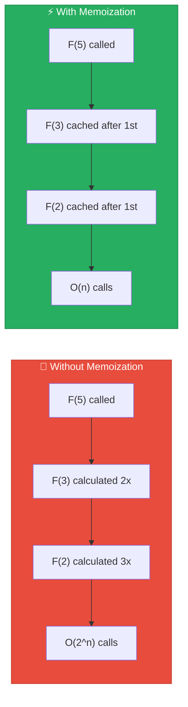
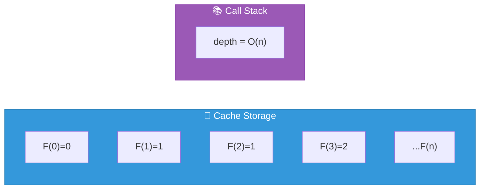
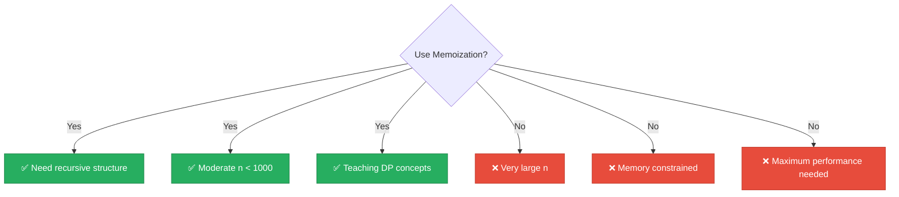

<div align="center">

# 💾 Memoized Recursion

[-yellow?style=flat-square)]()
[-yellow?style=flat-square)]()
[]()
[]()

*Transform exponential to linear with a simple cache*

</div>

---

## 📖 Overview

Memoization stores the results of expensive function calls and returns cached results when the same inputs occur again. Applied to Fibonacci, it transforms the exponential O(2^n) naive recursion into a **linear O(n)** algorithm.

> [!TIP]
> This technique demonstrates **top-down dynamic programming** — start with the original problem and recursively break it down while caching intermediate results.

---

## 🔢 Algorithm Description

### The Key Insight



### Python Implementation

```python
from functools import lru_cache

@lru_cache(maxsize=None)
def fibonacci(n):
    if n <= 1:
        return n
    return fibonacci(n - 1) + fibonacci(n - 2)
```

<details>
<summary>📋 <strong>Pseudocode</strong></summary>

```
INITIALIZE cache as empty dictionary

FUNCTION fibonacci(n):
    IF n IN cache:
        RETURN cache[n]

    IF n <= 1:
        result = n
    ELSE:
        result = fibonacci(n - 1) + fibonacci(n - 2)

    cache[n] = result
    RETURN result
```

</details>

---

## 📊 Complexity Analysis

### ⏱️ Time Complexity: `O(n)`

Each unique subproblem F(0), F(1), ..., F(n) is solved **exactly once**:

| Operation | Cost |
|-----------|------|
| First call to F(k) | O(1) work + recursive calls |
| Subsequent calls to F(k) | O(1) cache lookup |
| **Total** | **n+1 subproblems × O(1) = O(n)** |

### 💾 Space Complexity: `O(n)`



---

## 📈 Performance Comparison

| Metric | 🐢 Naive | 💾 Memoized |
|:------:|:--------:|:-----------:|
| Time | O(2^n) | O(n) |
| Space | O(n) | O(n) |
| F(40) calls | 331M | 41 unique |
| F(40) time | ~2 min | < 1ms |

> [!NOTE]
> In our **1-second benchmark**, this technique typically calculates thousands of Fibonacci numbers!

---

## 📈 Performance Characteristics

| n | Time | Cache Size |
|:-:|:----:|:----------:|
| 100 | < 1ms | 101 entries |
| 1,000 | < 10ms | 1,001 entries |
| 5,000 | ~50ms | 5,001 entries |
| 10,000 | ~100ms | 10,001 entries |

> [!WARNING]
> Python's default recursion limit (~1000) restricts the maximum n. Use iterative methods for very large n.

---

## 🔬 Mathematical Background

<details>
<summary>🔄 <strong>Overlapping Subproblems</strong></summary>

The Fibonacci problem exhibits "overlapping subproblems" — the same subproblems are encountered multiple times in different branches.

**Subproblem DAG (Directed Acyclic Graph):**

Instead of an exponential tree, memoization creates a DAG with n+1 nodes:

```
F(5) → F(4) → F(3) → F(2) → F(1)
  ↓      ↓      ↓      ↓
F(3)   F(2)   F(1)   F(0)
```

</details>

<details>
<summary>⬆️⬇️ <strong>Top-Down vs Bottom-Up</strong></summary>

| Aspect | 💾 Top-Down (Memoization) | 📊 Bottom-Up (Tabulation) |
|--------|--------------------------|--------------------------|
| Direction | Large → Small | Small → Large |
| Recursion | Yes | No |
| Stack overflow | Possible | No risk |
| Computes | Only needed subproblems | All subproblems |

</details>

---

## 🐍 Implementation Details

### Python's `lru_cache`

```python
from functools import lru_cache

@lru_cache(maxsize=None)  # None = unlimited cache
def fib(n):
    if n <= 1:
        return n
    return fib(n-1) + fib(n-2)
```

| Feature | Description |
|---------|-------------|
| 🔒 Thread-safe | Yes |
| ⚡ Lookup/Insert | O(1) average |
| 📊 Cache stats | `.cache_info()` |
| 🔄 Clear cache | `.cache_clear()` |

### Manual Dictionary Cache

```python
cache = {0: 0, 1: 1}

def fib(n):
    if n not in cache:
        cache[n] = fib(n-1) + fib(n-2)
    return cache[n]
```

### Handling Recursion Limit

```python
import sys
sys.setrecursionlimit(10000)  # ⚠️ Use with caution
```

---

## ✅ When to Use



---

## 📚 References

| # | Citation | Topic |
|:-:|----------|-------|
| 1 | **Michie, D.** (1968). "Memo Functions and Machine Learning". *Nature*, 218, 19-22. | Original memoization |
| 2 | **Cormen, T.H., et al.** (2009). *Introduction to Algorithms* (3rd ed.). MIT Press. Chapter 15. | Dynamic Programming |
| 3 | **Bellman, R.** (1957). *Dynamic Programming*. Princeton University Press. | Foundational DP |
| 4 | Python Documentation. `functools.lru_cache`. | Implementation |

---

## 💻 Example Usage

```python
from techniques.02_memoized_recursion.fibonacci import MemoizedRecursion

technique = MemoizedRecursion()

# First calculation - builds cache
print(technique.calculate(100))  # 354224848179261915075

# Subsequent calculations - uses cache
print(technique.calculate(50))   # 12586269025 (instant)

# Cache info (internal)
print(technique._fib.cache_info())
# CacheInfo(hits=49, misses=101, maxsize=None, currsize=101)
```

---

<div align="center">

[← Back to Main README](../../README.md)

</div>
