<div align="center">

# 📊 Dynamic Programming (Bottom-Up)

[-yellow?style=flat-square)]()
[-yellow?style=flat-square)]()
[]()
[]()

*Build up from base cases — the classic DP paradigm*

</div>

---

## 📖 Overview

The bottom-up dynamic programming approach builds the Fibonacci sequence **iteratively** from the base cases up to the target value. Also called "tabulation," this represents the classic DP paradigm of solving smaller subproblems first.

> [!TIP]
> No recursion means no stack overflow risk — perfect for larger values of n!

---

## 🔢 Algorithm Description


### Python Implementation

```python
def fibonacci(n):
    if n <= 1:
        return n

    dp = [0] * (n + 1)
    dp[0], dp[1] = 0, 1

    for i in range(2, n + 1):
        dp[i] = dp[i-1] + dp[i-2]

    return dp[n]
```

<details>
<summary>📋 <strong>Pseudocode</strong></summary>

```
FUNCTION fibonacci(n):
    IF n <= 1:
        RETURN n

    CREATE array dp[0..n]
    dp[0] = 0
    dp[1] = 1

    FOR i FROM 2 TO n:
        dp[i] = dp[i-1] + dp[i-2]

    RETURN dp[n]
```

</details>

---

## 📊 Complexity Analysis

### ⏱️ Time Complexity: `O(n)`

| Component | Cost |
|-----------|------|
| Loop iterations | n - 1 |
| Work per iteration | O(1) addition |
| **Total** | **O(n)** |

### 💾 Space Complexity: `O(n)`

```mermaid
flowchart LR
    subgraph Array["📦 DP Array"]
        A0["dp[0]=0"]
        A1["dp[1]=1"]
        A2["dp[2]=1"]
        A3["dp[3]=2"]
        AN["...dp[n]"]
    end

    style Array fill:#9b59b6,stroke:#8e44ad,color:#fff
```



> [!NOTE]
> This can be optimized to O(1) space — see [Iterative Space-Optimized](../10_iterative_space_optimized/).

---

## 🔬 Mathematical Background

<details>
<summary>🔄 <strong>Optimal Substructure</strong></summary>

The Fibonacci problem has **optimal substructure**: the optimal solution to F(n) is built from optimal solutions to F(n-1) and F(n-2).

```
F(n) = F(n-1) + F(n-2)
     ↑           ↑
  optimal    optimal
```

</details>

<details>
<summary>⬆️⬇️ <strong>Tabulation vs Memoization</strong></summary>

| Aspect | 📊 Bottom-Up (Tabulation) | 💾 Top-Down (Memoization) |
|--------|--------------------------|--------------------------|
| Direction | Small → Large | Large → Small |
| Recursion | ❌ No | ✅ Yes |
| Stack overflow | ❌ No risk | ⚠️ Possible |
| Computes | All subproblems | Only needed |
| Code style | Usually simpler | More intuitive |

</details>

---

## 📈 Performance Characteristics

| n | Time | Memory |
|:-:|:----:|:------:|
| 100 | < 1ms | ~1 KB |
| 1,000 | < 1ms | ~8 KB |
| 10,000 | ~5ms | ~80 KB |
| 100,000 | ~500ms | ~2 MB |

> [!TIP]
> In our **1-second benchmark**, this technique typically calculates thousands of Fibonacci numbers.

---

## 🐍 Implementation Details

### Python List Performance

| Operation | Complexity |
|-----------|------------|
| Pre-allocation `[0] * n` | O(n) |
| Index access `dp[i]` | O(1) |
| Append (amortized) | O(1) |

### Alternative Implementations

<details>
<summary>📝 <strong>Using append</strong></summary>

```python
dp = [0, 1]
for i in range(2, n + 1):
    dp.append(dp[-1] + dp[-2])
return dp[n]
```

</details>

<details>
<summary>⚡ <strong>Pre-allocated (slightly faster)</strong></summary>

```python
dp = [0] * (n + 1)
dp[1] = 1
for i in range(2, n + 1):
    dp[i] = dp[i-1] + dp[i-2]
return dp[n]
```

</details>

### Memory Considerations

For very large n, the O(n) space can become significant:

| n | F(n) Digits | Array Memory |
|:-:|:-----------:|:------------:|
| 1,000 | ~209 | ~8 KB |
| 10,000 | ~2,090 | ~80 KB |
| 100,000 | ~20,899 | ~2 MB |

---

## ✅ When to Use

```mermaid
flowchart TD
    A{Use Bottom-Up DP?} -->|Yes| B["✅ Need all F(0)...F(n)"]
    A -->|Yes| C["✅ Memory not critical"]
    A -->|Yes| D["✅ Want simple code"]
    A -->|No| E["❌ Only need single F(n)"]
    A -->|No| F["❌ Memory constrained"]
    A -->|No| G["❌ n extremely large"]

    style B fill:#27ae60,stroke:#1e8449,color:#fff
    style C fill:#27ae60,stroke:#1e8449,color:#fff
    style D fill:#27ae60,stroke:#1e8449,color:#fff
    style E fill:#e74c3c,stroke:#c0392b,color:#fff
    style F fill:#e74c3c,stroke:#c0392b,color:#fff
    style G fill:#e74c3c,stroke:#c0392b,color:#fff
```



---

## 📚 References

| # | Citation | Topic |
|:-:|----------|-------|
| 1 | **Bellman, R.** (1957). *Dynamic Programming*. Princeton University Press. | Foundational DP |
| 2 | **Cormen, T.H., et al.** (2009). *Introduction to Algorithms* (3rd ed.). MIT Press. Chapter 15. | Standard reference |
| 3 | **Kleinberg, J., & Tardos, E.** (2005). *Algorithm Design*. Addison-Wesley. Chapter 6. | DP techniques |

---

## 💻 Example Usage

```python
from techniques.03_dynamic_programming.fibonacci import DynamicProgramming

technique = DynamicProgramming()

# Calculate individual values
print(technique.calculate(10))   # 55
print(technique.calculate(50))   # 12586269025
print(technique.calculate(100))  # 354224848179261915075

# The internal array holds all values up to n
# This is efficient when you need multiple Fibonacci numbers
```

---

<div align="center">

[← Back to Main README](../../README.md)

</div>
