<div align="center">

# 🔢 Matrix Exponentiation

[-green?style=flat-square)]()
[-green?style=flat-square)]()
[]()
[]()

*Elegant O(log n) computation via matrix powers*

</div>

---

## 📖 Overview

Matrix exponentiation is an elegant **O(log n)** method for computing Fibonacci numbers based on a beautiful mathematical identity connecting Fibonacci numbers to matrix powers. Combined with binary exponentiation, this achieves logarithmic time complexity.

> [!TIP]
> This technique excels at computing **single large F(n)** values efficiently!

---

## 🔢 Algorithm Description

### The Matrix Identity

```mermaid
flowchart LR
    subgraph Matrix["🔢 Matrix Power"]
        M["[1 1]^n<br/>[1 0]"]
    end

    subgraph Result["📊 Result"]
        R["[F(n+1) F(n)]<br/>[F(n) F(n-1)]"]
    end

    Matrix --> Result

    style Matrix fill:#3498db,stroke:#2980b9,color:#fff
    style Result fill:#27ae60,stroke:#1e8449,color:#fff
```



$$\begin{bmatrix} F(n+1) & F(n) \\ F(n) & F(n-1) \end{bmatrix} = \begin{bmatrix} 1 & 1 \\ 1 & 0 \end{bmatrix}^n$$

### Binary Exponentiation

```mermaid
flowchart TD
    A["M^n"] --> B{n even?}
    B -->|Yes| C["(M^(n/2))²"]
    B -->|No| D["M × M^(n-1)"]
    C --> E["log n steps"]
    D --> E

    style E fill:#27ae60,stroke:#1e8449,color:#fff
```



### Python Implementation

```python
def matrix_pow(M, n):
    result = [[1, 0], [0, 1]]  # Identity
    while n > 0:
        if n % 2 == 1:
            result = matrix_mult(result, M)
        M = matrix_mult(M, M)
        n //= 2
    return result

def fib(n):
    if n <= 1:
        return n
    F = [[1, 1], [1, 0]]
    return matrix_pow(F, n-1)[0][0]
```

<details>
<summary>📋 <strong>Pseudocode</strong></summary>

```
FUNCTION fibonacci(n):
    IF n <= 1:
        RETURN n

    F = [[1, 1], [1, 0]]
    result = matrix_power(F, n-1)
    RETURN result[0][0]

FUNCTION matrix_power(M, n):
    result = [[1, 0], [0, 1]]  // Identity matrix

    WHILE n > 0:
        IF n is odd:
            result = matrix_multiply(result, M)
        M = matrix_multiply(M, M)
        n = n / 2

    RETURN result
```

</details>

---

## 📊 Complexity Analysis

### ⏱️ Time Complexity: `O(log n)`

| Component | Cost |
|-----------|------|
| Binary exponentiation iterations | O(log n) |
| Matrix multiplications per iteration | 1-2 |
| 2×2 matrix multiplication | O(1) |
| **Total** | **O(log n)** |

### 💾 Space Complexity: `O(log n)`

- Iterative version: O(1) for matrices
- Large integer storage: O(log n) for Fibonacci digits

---

## 📈 Performance Characteristics

| n | Matrix Multiplications | Time |
|:-:|:----------------------:|:----:|
| 100 | 7 | < 1ms |
| 1,000 | 10 | < 1ms |
| 10,000 | 14 | ~1ms |
| 100,000 | 17 | ~10ms |
| 1,000,000 | 20 | ~100ms |

> [!NOTE]
> The log n advantage becomes significant for very large n values!

---

## 🔬 Mathematical Background

<details>
<summary>📐 <strong>Proof of Matrix Identity</strong></summary>

**Base case (n=1):**
```
| 1  1 |¹   | F(2)  F(1) |   | 1  1 |
|      | = |            | = |      |
| 1  0 |    | F(1)  F(0) |   | 1  0 |
```

**Inductive step:** The recurrence can be written as:
```
| F(n+1) |   | 1  1 | | F(n)   |
|        | = |      | |        |
| F(n)   |   | 1  0 | | F(n-1) |
```

Applying repeatedly from base case proves the identity.

</details>

<details>
<summary>✨ <strong>Eigenvalue Connection</strong></summary>

The eigenvalues of [[1,1],[1,0]] are:
- λ₁ = φ = (1 + √5) / 2 (golden ratio)
- λ₂ = ψ = (1 - √5) / 2

This connects matrix exponentiation to Binet's formula and explains why both achieve O(log n).

</details>

<details>
<summary>⚡ <strong>Why Binary Exponentiation Works</strong></summary>

```
M^13 = M^(1101₂)
     = M^8 × M^4 × M^1
     = ((M²)²)² × (M²)² × M
```

By squaring, we halve the exponent each step → O(log n) multiplications.

</details>

---

## 🐍 Implementation Details

### Pure Python Matrix Multiplication

```python
def matrix_mult(A, B):
    return [
        [A[0][0]*B[0][0] + A[0][1]*B[1][0],
         A[0][0]*B[0][1] + A[0][1]*B[1][1]],
        [A[1][0]*B[0][0] + A[1][1]*B[1][0],
         A[1][0]*B[0][1] + A[1][1]*B[1][1]]
    ]
```

### NumPy Optimization

```python
import numpy as np

def fib_numpy(n):
    F = np.array([[1, 1], [1, 0]], dtype=object)
    result = np.linalg.matrix_power(F, n-1)
    return result[0, 0]
```

---

## ✅ When to Use

```mermaid
flowchart TD
    A{Use Matrix Exponentiation?} -->|Yes| B["✅ Single large F(n)"]
    A -->|Yes| C["✅ n > 10,000"]
    A -->|Yes| D["✅ Teaching O(log n) algorithms"]
    A -->|No| E["❌ Sequential F(0)...F(n)"]
    A -->|No| F["❌ Small n < 1000"]
    A -->|No| G["❌ Maximum simplicity needed"]

    style B fill:#27ae60,stroke:#1e8449,color:#fff
    style C fill:#27ae60,stroke:#1e8449,color:#fff
    style D fill:#27ae60,stroke:#1e8449,color:#fff
    style E fill:#e74c3c,stroke:#c0392b,color:#fff
    style F fill:#e74c3c,stroke:#c0392b,color:#fff
    style G fill:#e74c3c,stroke:#c0392b,color:#fff
```



---

## 📚 References

| # | Citation | Topic |
|:-:|----------|-------|
| 1 | **Gries, D., & Levin, G.** (1980). "Computing Fibonacci Numbers in Log Time". *IPL*, 11(2). | O(log n) method |
| 2 | **Cormen, T.H., et al.** (2009). *Introduction to Algorithms* (3rd ed.). Section 31.6. | Binary exponentiation |
| 3 | **Sedgewick, R., & Wayne, K.** (2011). *Algorithms* (4th ed.). | Number-theoretic algorithms |

---

## 💻 Example Usage

```python
from techniques.04_matrix_exponentiation.fibonacci import MatrixExponentiation

technique = MatrixExponentiation()

# Small values
print(technique.calculate(10))   # 55
print(technique.calculate(50))   # 12586269025

# Large values - this is where matrix method shines
print(technique.calculate(1000))  # 70-digit number, very fast

# Very large - still logarithmic time
import time
start = time.time()
result = technique.calculate(100000)
print(f"F(100000) has {len(str(result))} digits")
print(f"Computed in {time.time()-start:.3f}s")
```

---

<div align="center">

[← Back to Main README](../../README.md)

</div>
