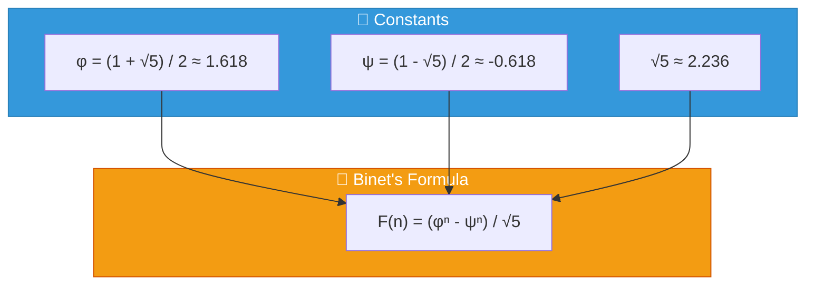
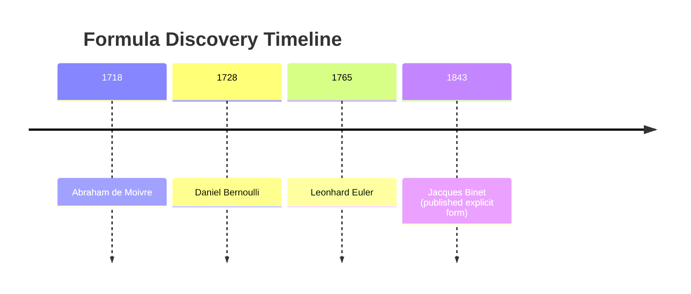
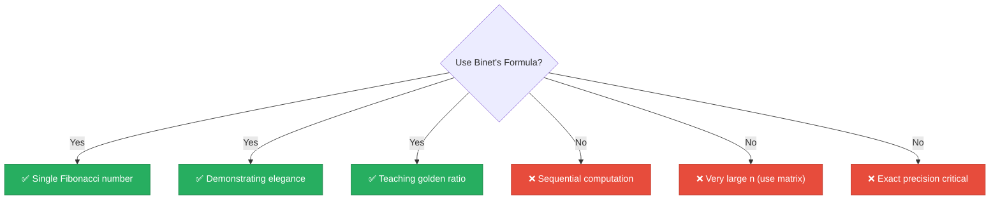

<div align="center">

# 🌟 Binet's Formula

[*-brightgreen?style=flat-square)]()
[-brightgreen?style=flat-square)]()
[]()
[]()

*The elegant closed-form formula using the golden ratio φ*

</div>

---

## 📖 Overview

Binet's formula provides a **closed-form expression** for computing Fibonacci numbers directly using the golden ratio, without iteration or recursion. This elegant mathematical formula demonstrates the deep connection between the Fibonacci sequence and φ.

> [!IMPORTANT]
> *O(1) assumes bounded precision. For arbitrary precision, computing φⁿ for n-bit precision takes O(n) time.

---

## 🔢 Algorithm Description

### The Formula



### Simplified Approximation

Since |ψ| < 1, the term ψⁿ becomes negligible for large n:

$$F(n) \approx \frac{\phi^n}{\sqrt{5}} \quad \text{(rounded to nearest integer)}$$

### Python Implementation

```python
from decimal import Decimal, getcontext
getcontext().prec = 100  # High precision

sqrt5 = Decimal(5).sqrt()
phi = (1 + sqrt5) / 2
psi = (1 - sqrt5) / 2

def fibonacci(n):
    if n <= 1:
        return n
    result = (phi**n - psi**n) / sqrt5
    return int(result.to_integral_value())
```

---

## 📊 Complexity Analysis

### ⏱️ Time Complexity: `O(1)*`

| Component | Cost |
|-----------|------|
| Constant operations | O(1) |
| Exponentiation (fixed precision) | O(1) |
| High precision exponentiation | O(log n × M(k)) |

### 💾 Space Complexity: `O(1)`

Only stores a constant number of values regardless of n.

---

## 📈 Precision Requirements

| n | Precision Needed | Float64 Accurate? |
|:-:|:---------------:|:-----------------:|
| 10 | Low | ✅ Yes |
| 50 | Medium | ✅ Yes |
| 70 | High | ⚠️ Borderline |
| 100 | Very High | ❌ Use Decimal |
| 1000 | Extreme | ❌ High precision |

> [!WARNING]
> Standard floating-point (float64) loses accuracy around n=70. Use `Decimal` for larger values.

---

## 🔬 Mathematical Background

<details>
<summary>📝 <strong>Proof of Binet's Formula</strong></summary>

**Step 1**: Characteristic equation
```
x² = x + 1
x² - x - 1 = 0
```

**Step 2**: Solve using quadratic formula
```
x = (1 ± √5) / 2
φ = (1+√5)/2, ψ = (1-√5)/2
```

**Step 3**: General solution form
```
F(n) = Aφⁿ + Bψⁿ
```

**Step 4**: Apply initial conditions
```
F(0) = A + B = 0         → B = -A
F(1) = Aφ + Bψ = 1       → A = 1/√5, B = -1/√5
```

**Step 5**: Final formula
```
F(n) = (φⁿ - ψⁿ) / √5
```

</details>

<details>
<summary>✨ <strong>The Golden Ratio</strong></summary>

| Property | Formula | Value |
|----------|---------|-------|
| Definition | φ = (1 + √5) / 2 | ≈ 1.618 |
| Self-squaring | φ² = φ + 1 | 2.618... |
| Reciprocal | 1/φ = φ - 1 | 0.618... |
| Continued fraction | 1 + 1/(1 + 1/(1 + ...)) | φ |

</details>

<details>
<summary>📉 <strong>Why ψⁿ Vanishes</strong></summary>

Since |ψ| ≈ 0.618 < 1:

| n | ψⁿ |
|:-:|:--:|
| 1 | -0.618 |
| 5 | -0.090 |
| 10 | 0.008 |
| 20 | 0.00007 |

For practical computation: **F(n) ≈ round(φⁿ/√5)** works for all n!

</details>

---

## 🐍 Implementation Details

### Floating Point Version (Fast but Limited)

```python
import math

PHI = (1 + math.sqrt(5)) / 2
SQRT5 = math.sqrt(5)

def fib_float(n):
    return round(PHI**n / SQRT5)
```

> Works for n ≤ ~70

### Decimal Version (Accurate)

```python
from decimal import Decimal, getcontext
getcontext().prec = 500  # Adjust as needed

sqrt5 = Decimal(5).sqrt()
phi = (Decimal(1) + sqrt5) / 2

def fib_decimal(n):
    result = phi**n / sqrt5
    return int(result.to_integral_value())
```

### Precision Formula

To accurately compute F(n), you need:
```
digits ≈ n × log₁₀(φ) ≈ 0.209n decimal digits
```

| n | F(n) Digits |
|:-:|:-----------:|
| 100 | ~21 |
| 1,000 | ~209 |
| 10,000 | ~2,090 |

---

## 📜 Historical Note

Although called "Binet's Formula," it was known to:



---

## ✅ When to Use



---

## 📚 References

| # | Citation | Topic |
|:-:|----------|-------|
| 1 | **Binet, J.P.M.** (1843). *Comptes Rendus de l'Académie des Sciences*, Paris. | Original publication |
| 2 | **Koshy, T.** (2001). *Fibonacci and Lucas Numbers with Applications*. Wiley. | Comprehensive reference |
| 3 | **Vorobiev, N.N.** (2002). *Fibonacci Numbers*. Birkhäuser. | Accessible introduction |
| 4 | **Dunlap, R.A.** (1997). *The Golden Ratio and Fibonacci Numbers*. World Scientific. | Golden ratio |

---

## 💻 Example Usage

```python
from techniques.05_binets_formula.fibonacci import BinetsFormula

technique = BinetsFormula()

# Fast direct calculation
print(technique.calculate(10))   # 55
print(technique.calculate(50))   # 12586269025
print(technique.calculate(100))  # 354224848179261915075

# Verify the golden ratio approximation
phi = 1.6180339887498949
sqrt5 = 2.23606797749979
print(f"F(10) ≈ {round(phi**10 / sqrt5)}")  # 55
```

---

<div align="center">

[← Back to Main README](../../README.md)

</div>
