<div align="center">

# 🔄 Generator-based

[-yellow?style=flat-square)]()
[-brightgreen?style=flat-square)]()
[]()
[]()

*Lazy evaluation with Python's elegant generator pattern*

</div>

---

## 📖 Overview

The generator-based approach uses Python's generator pattern to produce Fibonacci numbers **lazily**. This is a memory-efficient, Pythonic way to work with sequences that demonstrates Python's powerful iteration protocol.

> [!TIP]
> Generators are perfect when you need to **stream** values without storing them all in memory!

---

## 🔢 Algorithm Description


### Python Implementation

```python
def fibonacci_generator():
    a, b = 0, 1
    while True:
        yield a
        a, b = b, a + b

def fibonacci(n):
    gen = fibonacci_generator()
    for _ in range(n):
        next(gen)
    return next(gen)
```

<details>
<summary>📋 <strong>Pseudocode</strong></summary>

```
GENERATOR fibonacci_sequence():
    a = 0
    b = 1
    LOOP FOREVER:
        YIELD a
        temp = a + b
        a = b
        b = temp

FUNCTION fibonacci(n):
    gen = fibonacci_sequence()
    FOR i FROM 0 TO n-1:
        ADVANCE gen
    RETURN NEXT VALUE FROM gen
```

</details>

---

## 📊 Complexity Analysis

### ⏱️ Time Complexity: `O(n)`

| Component | Cost |
|-----------|------|
| Iterations to reach F(n) | n + 1 |
| Work per iteration | O(1) |
| **Total** | **O(n)** |

### 💾 Space Complexity: `O(1)`


- Only stores two variables (a, b)
- No array, no recursion stack
- **Constant memory** regardless of n

---

## 📈 Performance Characteristics

| n | Time | Memory |
|:-:|:----:|:------:|
| 100 | < 1ms | O(1) |
| 1,000 | < 1ms | O(1) |
| 10,000 | ~5ms | O(1) |
| 100,000 | ~50ms | O(1) |

> [!NOTE]
> In our **1-second benchmark**, similar performance to iterative methods with slight generator overhead.

---

## 🐍 Generator Mechanics

<details>
<summary>⚙️ <strong>How Generators Work</strong></summary>

```python
def gen():
    print("Before first yield")
    yield 1
    print("Before second yield")
    yield 2

g = gen()
print(next(g))  # Prints "Before first yield", returns 1
print(next(g))  # Prints "Before second yield", returns 2
```

**Lifecycle:**
1. Return iterator object when called
2. Execute code until `yield`
3. Suspend, saving state
4. Resume on `next()`
5. Raise `StopIteration` when exhausted

</details>

<details>
<summary>🔄 <strong>Generator vs Iterator Class</strong></summary>

**Generator function (concise):**
```python
def fib_gen():
    a, b = 0, 1
    while True:
        yield a
        a, b = b, a + b
```

**Equivalent iterator class (verbose):**
```python
class FibIterator:
    def __init__(self):
        self.a, self.b = 0, 1

    def __iter__(self):
        return self

    def __next__(self):
        result = self.a
        self.a, self.b = self.b, self.a + self.b
        return result
```

</details>

---

## 💡 Usage Patterns

### With `itertools`

```python
from itertools import islice, takewhile

gen = fibonacci_generator()

# First N Fibonacci numbers
first_10 = list(islice(gen, 10))
# [0, 1, 1, 2, 3, 5, 8, 13, 21, 34]

# Fibonacci numbers below limit
gen = fibonacci_generator()
below_100 = list(takewhile(lambda x: x < 100, gen))
# [0, 1, 1, 2, 3, 5, 8, 13, 21, 34, 55, 89]

# Sum of first N
total = sum(islice(fibonacci_generator(), 10))
```

### Memory Advantage

| Method | Memory for F(1,000,000) |
|--------|:----------------------:|
| 📊 DP Array | ~20 MB |
| 🔄 Generator | ~1 KB |

---

## ✅ When to Use

```mermaid
flowchart TD
    A{Use Generator?} -->|Yes| B["✅ Streaming values"]
    A -->|Yes| C["✅ Memory constrained"]
    A -->|Yes| D["✅ Working with itertools"]
    A -->|Yes| E["✅ First N Fibonacci numbers"]
    A -->|No| F["❌ Random access to F(n)"]
    A -->|No| G["❌ Single large F(n)"]
    A -->|No| H["❌ Reusing computed values"]

    style B fill:#27ae60,stroke:#1e8449,color:#fff
    style C fill:#27ae60,stroke:#1e8449,color:#fff
    style D fill:#27ae60,stroke:#1e8449,color:#fff
    style E fill:#27ae60,stroke:#1e8449,color:#fff
    style F fill:#e74c3c,stroke:#c0392b,color:#fff
    style G fill:#e74c3c,stroke:#c0392b,color:#fff
    style H fill:#e74c3c,stroke:#c0392b,color:#fff
```



---

## 🐍 Pythonic Patterns

```python
# With enumerate
for i, fib in enumerate(islice(fibonacci_generator(), 10)):
    print(f"F({i}) = {fib}")

# Write to file
with open('fibs.txt', 'w') as f:
    for fib in islice(fibonacci_generator(), 100):
        f.write(f"{fib}\n")

# Count even Fibonacci numbers
count = sum(1 for f in islice(fibonacci_generator(), 1000) if f % 2 == 0)
```

---

## 📚 References

| # | Citation | Topic |
|:-:|----------|-------|
| 1 | Python Documentation. "Generators". | Official docs |
| 2 | **Ramalho, L.** (2015). *Fluent Python*. O'Reilly. Chapter 14. | Iterables & Generators |
| 3 | **Beazley, D.** (2009). *Python Essential Reference* (4th ed.). Chapter 6. | Python internals |
| 4 | PEP 255 -- Simple Generators. | Python Enhancement |

---

## 💻 Example Usage

```python
from techniques.06_generator_based.fibonacci import GeneratorBased
from itertools import islice

technique = GeneratorBased()

# Single value
print(technique.calculate(10))   # 55
print(technique.calculate(100))  # 354224848179261915075

# Using the generator directly
gen = technique.get_generator()
first_ten = [next(gen) for _ in range(10)]
print(first_ten)  # [0, 1, 1, 2, 3, 5, 8, 13, 21, 34]

# Memory-efficient: iterate without storing
gen = technique.get_generator()
count = sum(1 for f in islice(gen, 1000) if f % 2 == 0)
print(f"Even Fibonacci numbers in first 1000: {count}")
```

---

<div align="center">

[← Back to Main README](../../README.md)

</div>
