<div align="center">

# 🧊 NumPy Vectorized

[-green?style=flat-square)]()
[-brightgreen?style=flat-square)]()
[]()
[]()

*C-level matrix operations with NumPy's optimized BLAS/LAPACK*

</div>

---

## 📖 Overview

This technique leverages NumPy's highly optimized C-level implementations for matrix operations to compute Fibonacci numbers using matrix exponentiation. NumPy provides the performance of compiled code with the convenience of Python.

> [!TIP]
> NumPy is the foundational package for scientific computing in Python, making this a natural choice for numerical applications.

---

## 🔢 Algorithm Description

```mermaid
flowchart LR
    subgraph NumPy["🧊 NumPy"]
        A["np.array([[1,1],[1,0]])"]
        B["np.linalg.matrix_power"]
    end

    subgraph Result["📊 Result"]
        C["F(n) in O(log n)"]
    end

    NumPy --> Result

    style NumPy fill:#013243,stroke:#0d6e8e,color:#fff
    style Result fill:#27ae60,stroke:#1e8449,color:#fff
```



### Python Implementation

```python
import numpy as np

def fibonacci(n):
    if n <= 1:
        return n
    F = np.array([[1, 1], [1, 0]], dtype=object)
    result = np.linalg.matrix_power(F, n - 1)
    return int(result[0, 0])
```

> `np.linalg.matrix_power(M, n)` efficiently computes M^n using binary exponentiation internally.

---

## 📊 Complexity Analysis

### ⏱️ Time Complexity: `O(log n)`

| Component | Cost |
|-----------|------|
| Binary exponentiation | O(log n) |
| 2×2 matrix multiplication | O(1) |
| **Total** | **O(log n)** |

### 💾 Space Complexity: `O(1)`

- Fixed-size 2×2 matrices
- No additional arrays needed

---

## 📈 Performance Characteristics

| n | Time | Notes |
|:-:|:----:|:------|
| 100 | < 1ms | Fast |
| 1,000 | < 1ms | Still fast |
| 10,000 | ~1ms | Logarithmic |
| 100,000 | ~10ms | Large integer arithmetic dominates |
| 1,000,000 | ~500ms | Very large integers |

> [!NOTE]
> NumPy overhead may make it slower than simple iteration for small n, but it excels for larger values.

---

## 🐍 Implementation Details

### Data Types

<details>
<summary>⚠️ <strong>Native types (limited precision)</strong></summary>

```python
F = np.array([[1, 1], [1, 0]], dtype=np.int64)
# Overflow at F(93) = 12200160415121876738 (exceeds int64)
```

</details>

<details>
<summary>✅ <strong>Object dtype (arbitrary precision)</strong></summary>

```python
F = np.array([[1, 1], [1, 0]], dtype=object)
# Supports Python's arbitrary precision integers
```

</details>

### NumPy vs Pure Python

| Aspect | 🧊 NumPy | 🐍 Pure Python |
|--------|:--------:|:--------------:|
| Setup overhead | Higher | Lower |
| Small n | Slower | Faster |
| Large n | Faster | Slower |
| Dependencies | Requires NumPy | None |
| Memory layout | Contiguous C array | Python objects |

---

## ✅ When to Use

```mermaid
flowchart TD
    A{Use NumPy Vectorized?} -->|Yes| B["✅ Already using NumPy"]
    A -->|Yes| C["✅ Numerical pipelines"]
    A -->|Yes| D["✅ Need O(log n) complexity"]
    A -->|No| E["❌ Minimizing dependencies"]
    A -->|No| F["❌ Very small n"]
    A -->|No| G["❌ Memory constrained"]

    style B fill:#27ae60,stroke:#1e8449,color:#fff
    style C fill:#27ae60,stroke:#1e8449,color:#fff
    style D fill:#27ae60,stroke:#1e8449,color:#fff
    style E fill:#e74c3c,stroke:#c0392b,color:#fff
    style F fill:#e74c3c,stroke:#c0392b,color:#fff
    style G fill:#e74c3c,stroke:#c0392b,color:#fff
```



---

## 📚 References

| # | Citation | Topic |
|:-:|----------|-------|
| 1 | **Harris, C.R., et al.** (2020). "Array programming with NumPy". *Nature*, 585, 357-362. | NumPy paper |
| 2 | NumPy Documentation. "Linear Algebra (numpy.linalg)". | Official docs |
| 3 | **Van Der Walt, S., et al.** (2011). "The NumPy Array". *Computing in Science & Engineering*. | Array structure |

---

## 💻 Example Usage

```python
from techniques.07_numpy_vectorized.fibonacci import NumpyVectorized
import numpy as np

technique = NumpyVectorized()

# Calculate Fibonacci numbers
print(technique.calculate(10))   # 55
print(technique.calculate(50))   # 12586269025
print(technique.calculate(100))  # 354224848179261915075

# Direct NumPy usage
F = np.array([[1, 1], [1, 0]], dtype=object)
result = np.linalg.matrix_power(F, 99)
print(result[0, 0])  # F(100)
```

---

<div align="center">

[← Back to Main README](../../README.md)

</div>
