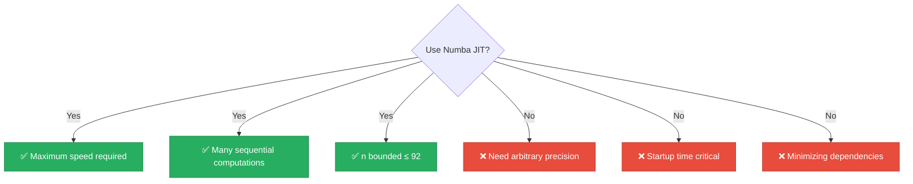

<div align="center">

# ⚡ Numba JIT

[-yellow?style=flat-square)]()
[-brightgreen?style=flat-square)]()
[]()
[]()

*Near-C performance with pure Python syntax via LLVM compilation*

</div>

---

## 📖 Overview

Numba is a **Just-In-Time (JIT) compiler** that translates Python code to optimized machine code using LLVM. This technique demonstrates how to achieve near-C performance while writing pure Python.

> [!TIP]
> Numba is one of the **fastest** methods for numerical Fibonacci computation when n ≤ 92!

---

## 🔢 Algorithm Description


### Python Implementation

```python
from numba import jit

@jit(nopython=True, cache=True)
def fibonacci(n):
    if n <= 1:
        return n
    a, b = 0, 1
    for i in range(2, n + 1):
        a, b = b, a + b
    return b
```

### Decorator Options

| Option | Description |
|--------|-------------|
| `nopython=True` | Force compilation without Python fallback |
| `cache=True` | Save compiled code to disk |
| `parallel=True` | Enable automatic parallelization |
| `fastmath=True` | Faster but less precise floating-point |

---

## 📊 Complexity Analysis

### ⏱️ Time Complexity: `O(n)`

Same as iterative Python, but with **much smaller constant factors**:

| Factor | Benefit |
|--------|---------|
| No interpreter overhead | Direct CPU instructions |
| Register optimization | Variables in CPU registers |
| Cache-friendly | CPU cache-optimized |

### 💾 Space Complexity: `O(1)`

- Two variables stored in CPU registers
- No dynamic memory allocation

---

## 📈 Performance Comparison

| n | 🐍 Pure Python | ⚡ Numba | Speedup |
|:-:|:--------------:|:-------:|:-------:|
| 100 | ~1μs | ~0.1μs | ~10x |
| 1,000 | ~10μs | ~0.5μs | ~20x |
| 10,000 | ~100μs | ~5μs | ~20x |
| 92 (max int64) | ~10μs | ~0.5μs | ~20x |

> [!WARNING]
> For n > 92, Numba overflows (int64 limit). Our implementation falls back to Python for larger values.

---

## 🔬 How It Works

<details>
<summary>⚙️ <strong>First Call Compilation</strong></summary>

```python
@jit(nopython=True)
def fib(n):
    # ...

# First call triggers compilation (~100ms)
fib(10)

# Subsequent calls use compiled code (~1μs)
fib(10)
```

</details>

<details>
<summary>🔤 <strong>Type Inference</strong></summary>

Numba infers types from function arguments:

```python
@jit(nopython=True)
def fib(n):  # n inferred as int64
    a, b = 0, 1  # inferred as int64
    # ...
```

Explicit signature:

```python
from numba import jit, int64

@jit(int64(int64), nopython=True)
def fib(n):
    # returns int64, takes int64
```

</details>

<details>
<summary>💾 <strong>Caching</strong></summary>

With `cache=True`, compiled code is saved to disk:

```
__pycache__/fibonacci.cpython-311.nbc
```

This eliminates compilation time on subsequent program runs.

</details>

---

## ⚠️ Limitations

| Limitation | Impact |
|------------|--------|
| 🔢 Integer size | int64 max, no arbitrary precision |
| ⏱️ Compilation time | First call is slow |
| 📝 Type constraints | Must use Numba-supported types |
| 🚫 Feature limits | Can't use all Python features |

---

## ✅ When to Use



---

## 📊 Comparison with Other Compiled Approaches

| Approach | Compilation | Ease of Use | Speed | Portability |
|----------|:-----------:|:-----------:|:-----:|:-----------:|
| ⚡ Numba | JIT | Easy | Very fast | Good |
| 🚀 Cython | AOT | Moderate | Fast | Requires compilation |
| 🐍 PyPy | JIT | Transparent | Fast | Separate interpreter |
| ⚙️ C Extension | AOT | Difficult | Very fast | Requires C |

---

## 📚 References

| # | Citation | Topic |
|:-:|----------|-------|
| 1 | **Lam, S.K., et al.** (2015). "Numba: A LLVM-based Python JIT Compiler". *LLVM-HPC Workshop*. | Numba paper |
| 2 | Numba Documentation. https://numba.pydata.org/ | Official docs |
| 3 | LLVM Project. https://llvm.org/ | Compiler infrastructure |

---

## 💻 Example Usage

```python
from techniques.08_numba_jit.fibonacci import NumbaJIT

technique = NumbaJIT()

# Warm up (triggers compilation)
technique.setup()

# Fast compiled execution
print(technique.calculate(10))   # 55
print(technique.calculate(50))   # 12586269025
print(technique.calculate(92))   # 7540113804746346429 (max for int64)

# Falls back to Python for large n
print(technique.calculate(100))  # 354224848179261915075

# Benchmark
import time
start = time.perf_counter()
for i in range(100000):
    technique.calculate(50)
numba_time = time.perf_counter() - start
print(f"Numba: {numba_time:.3f}s for 100k calls")
```

---

<div align="center">

[← Back to Main README](../../README.md)

</div>
