<div align="center">

# 🚀 Cython Optimized

[-yellow?style=flat-square)]()
[-brightgreen?style=flat-square)]()
[]()
[]()

*C-extension performance with Python-like syntax*

</div>

---

## 📖 Overview

Cython is a programming language that makes writing **C extensions** for Python easy. It allows Python-like code with optional static type declarations that compile to highly efficient C code.

> [!TIP]
> Cython achieves **10-100x speedup** over pure Python through elimination of interpreter overhead!

---

## 🔢 Algorithm Description


### Cython Implementation

```cython
cpdef long long fib_cython(int n):
    cdef long long a, b, temp
    cdef int i

    if n <= 1:
        return n

    a, b = 0, 1
    for i in range(2, n + 1):
        temp = a + b
        a = b
        b = temp

    return b
```

### Key Cython Features

| Feature | Description |
|---------|-------------|
| `cpdef` | Function callable from Python and C |
| `cdef` | C-level variable declarations |
| `long long` | 64-bit integer type |
| `int` | 32-bit integer type |

---

## 📊 Complexity Analysis

### ⏱️ Time Complexity: `O(n)`

Same algorithm as pure Python, but:

| Factor | Benefit |
|--------|---------|
| Direct C operations | No Python dispatch |
| Compiled loops | No interpreter |
| CPU registers | Efficient storage |

### 💾 Space Complexity: `O(1)`

- Three C variables (a, b, temp)
- No Python object overhead

---

## 📈 Performance Comparison

| n | 🐍 Pure Python | 🚀 Cython | Speedup |
|:-:|:--------------:|:---------:|:-------:|
| 100 | ~1μs | ~0.05μs | ~20x |
| 1,000 | ~10μs | ~0.5μs | ~20x |
| 10,000 | ~100μs | ~5μs | ~20x |
| 92 (max) | ~10μs | ~0.4μs | ~25x |

> [!NOTE]
> In our **1-second benchmark**, Cython is among the fastest, computing millions of values for small n.

---

## ⚙️ Compilation Process


<details>
<summary>📋 <strong>Step-by-step</strong></summary>

**Step 1**: Write .pyx file

```cython
# fibonacci_impl.pyx
cpdef long long fib_cython(int n):
    ...
```

**Step 2**: Create setup.py

```python
from setuptools import setup
from Cython.Build import cythonize

setup(ext_modules=cythonize("fibonacci_impl.pyx"))
```

**Step 3**: Compile

```bash
python setup.py build_ext --inplace
```

**Step 4**: Use

```python
from fibonacci_impl import fib_cython
print(fib_cython(50))  # 12586269025
```

</details>

---

## ⚠️ Limitations

| Limitation | Impact |
|------------|--------|
| 📦 Compilation required | Must compile before use |
| 💻 Platform-specific | Binaries are OS/CPU specific |
| 🔢 Integer overflow | long long overflows at F(93) |
| ♾️ No arbitrary precision | Uses fixed C types |

---

## ✅ When to Use

```mermaid
flowchart TD
    A{Use Cython?} -->|Yes| B["✅ Maximum performance needed"]
    A -->|Yes| C["✅ Compilation acceptable"]
    A -->|Yes| D["✅ Distributing binary packages"]
    A -->|No| E["❌ Need arbitrary precision"]
    A -->|No| F["❌ Can't compile"]
    A -->|No| G["❌ Pure Python required"]

    style B fill:#27ae60,stroke:#1e8449,color:#fff
    style C fill:#27ae60,stroke:#1e8449,color:#fff
    style D fill:#27ae60,stroke:#1e8449,color:#fff
    style E fill:#e74c3c,stroke:#c0392b,color:#fff
    style F fill:#e74c3c,stroke:#c0392b,color:#fff
    style G fill:#e74c3c,stroke:#c0392b,color:#fff
```



---

## 📊 Comparison with Alternatives

| Aspect | 🚀 Cython | ⚡ Numba | 🐍 PyPy | Pure Python |
|--------|:---------:|:-------:|:------:|:-----------:|
| Compilation | AOT | JIT | JIT | None |
| Startup time | Fast | Slow | Fast | Fast |
| Dependencies | Cython + C compiler | LLVM | None | None |
| Ease of use | Moderate | Easy | Easy | Easiest |
| Performance | Very fast | Very fast | Fast | Slow |

---

## 📚 References

| # | Citation | Topic |
|:-:|----------|-------|
| 1 | **Behnel, S., et al.** (2011). "Cython: The Best of Both Worlds". *Computing in Science & Engineering*. | Cython paper |
| 2 | Cython Documentation. https://cython.readthedocs.io/ | Official docs |
| 3 | **Smith, K.** (2015). *Cython: A Guide for Python Programmers*. O'Reilly. | Comprehensive guide |

---

## 💻 Example Usage

```python
from techniques.09_cython_optimized.fibonacci import CythonOptimized

technique = CythonOptimized()

# Check if compiled
print(f"Cython compiled: {technique.is_compiled()}")

# Calculate Fibonacci numbers
print(technique.calculate(10))   # 55
print(technique.calculate(50))   # 12586269025
print(technique.calculate(92))   # 7540113804746346429 (max)
print(technique.calculate(100))  # Falls back to Python

# Benchmark if compiled
if technique.is_compiled():
    from techniques.09_cython_optimized.fibonacci_impl import fib_cython
    import time
    start = time.perf_counter()
    for i in range(1000000):
        fib_cython(50)
    elapsed = time.perf_counter() - start
    print(f"1M calls in {elapsed:.3f}s")
```

---

<div align="center">

[← Back to Main README](../../README.md)

</div>
